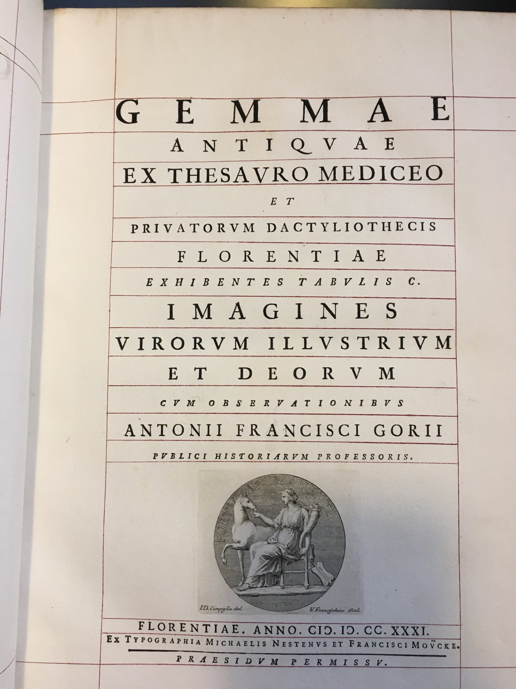

## Document n°1

   

      <input name="carousel" class="carousel-open" id="carousel-1" aria-hidden="true" type="radio" hidden="true" Checked/>
      

      

      <input name="carousel" class="carousel-open" id="carousel-2" aria-hidden="true" type="radio" hidden="true"/>
      

  
      

      <input name="carousel" class="carousel-open" id="carousel-3" aria-hidden="true" type="radio" hidden="true"/>
      

      

      <label class="carousel-control prev control-1" for="carousel-3">‹</label>
      <label class="carousel-control next control-1" for="carousel-2">›</label>
      <label class="carousel-control prev control-2" for="carousel-1">‹</label>
      <label class="carousel-control next control-2" for="carousel-3">›</label>
      <label class="carousel-control prev control-3" for="carousel-2">‹</label>
      <label class="carousel-control next control-3" for="carousel-1">›</label>

      <ol class="carousel-indicators">
         <li>
            <label class="carousel-bullet" for="carousel-1">●</label>
            

              
            

         </li>
         <li>
            <label class="carousel-bullet" for="carousel-2">●</label>
            

              
            

          </li>  
         <li>
            <label class="carousel-bullet" for="carousel-3">●</label>
            

              
            

         </li>
    </ol>

### Cartel

**Titre** : ????  
**Date de publication** : ????  
**Editeur** : ??????  
**Cote** : ??????  

[Consulter le document numérisé](https://bibliotheque-numerique.inha.fr/collection/item/13543-lettres-familieres-de-m-winckelmann-premiere-partie?offset=2)

### Description de l'objet
Lorem ipsum dolor sit amet, consectetur adipiscing elit. Quisque ac vestibulum metus, ac suscipit tellus. Nullam suscipit risus mollis ultricies semper. Aliquam imperdiet risus ac quam congue, eget volutpat sem porttitor[^1]. Fusce condimentum dolor vel metus scelerisque pharetra. Aenean bibendum semper libero, nec aliquet justo mattis a. Nam a ipsum posuere, accumsan ipsum eu, vestibulum odio. Vestibulum rutrum lectus nisi, at accumsan est euismod non. Suspendisse tincidunt sodales posuere. Ut condimentum finibus neque, eu ornare nisi dignissim et. Praesent aliquet mi sed nibh dictum, non eleifend sapien fermentum. Morbi eget sem vel tellus vulputate auctor. Proin vitae elementum tortor. Nulla nec fermentum urna.

Donec vitae enim efficitur metus tincidunt viverra. Phasellus ut turpis ante. Nulla at gravida orci, et sagittis neque. Integer feugiat lorem vitae sapien efficitur, eu porttitor nisi congue. Aliquam condimentum mollis ligula vel pellentesque. Vestibulum sollicitudin velit magna, quis consequat ex rhoncus eget. Integer eu tristique lacus. Nullam vitae enim efficitur, rutrum nunc ultricies, finibus nisl.

<small>
[^1]: Note de bas de page
</small>

