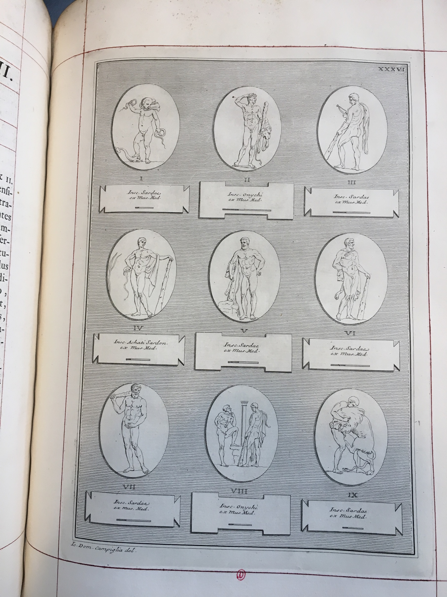



### Document n°1 - Anton Francesco Gori (1691-1757)

   

      <input name="carousel" class="carousel-open" id="carousel-1" aria-hidden="true" type="radio" hidden="true" Checked/>
      

      

      <input name="carousel" class="carousel-open" id="carousel-2" aria-hidden="true" type="radio" hidden="true"/>
      

  
      

      <input name="carousel" class="carousel-open" id="carousel-3" aria-hidden="true" type="radio" hidden="true"/>
      

      

      <label class="carousel-control prev control-1" for="carousel-3">‹</label>
      <label class="carousel-control next control-1" for="carousel-2">›</label>
      <label class="carousel-control prev control-2" for="carousel-1">‹</label>
      <label class="carousel-control next control-2" for="carousel-3">›</label>
      <label class="carousel-control prev control-3" for="carousel-2">‹</label>
      <label class="carousel-control next control-3" for="carousel-1">›</label>

      <ol class="carousel-indicators">
         <li>
            <label class="carousel-bullet" for="carousel-1">●</label>
            

              
            

         </li>
         <li>
            <label class="carousel-bullet" for="carousel-2">●</label>
            

              
            

          </li>  
         <li>
            <label class="carousel-bullet" for="carousel-3">●</label>
            

              
            

         </li>
    </ol>

***

**Document n°1 - Anton Francesco Gori (1691-1757)**

**_Museum florentinum exhibens insigniora vetustatis monumenta quae Florentiae sunt, Ioanni Gastoni Etruriae Magno Duci dedicatum._**

**_I, Gemmae antiquae ex thesauro mediceo et privatorum dactyliothecis Florentiae exhibentes tabulis_**
**_c. Imagines virorum illustrium et deorum cum observationibus Antonii Francisci Gorii publici historiarum professoris, Florence,_**

**_ex typographia Michaelis Nestenus et Francisci Moücke, 1731-1732_**

**Brunet, t.2, col. 1670. [Cote FOL Res 399 (1-6)](http://bibliotheque.inha.fr/iguana/www.main.cls?surl=search&p=74469586-3948-11e2-a8f1-ac6f86effe00#recordId=1.226416)**

***

[exemplaire numérisé d'une autre bibliothèque](http://gallica.bnf.fr/ark:/12148/bpt6k888083n){:target="_blank"}

2 volumes in-folio (47 x 36 cm).

Reliure en maroquin rouge, encadrement doré sur les plats avec au centre du premier plat de chaque volume des armes frappées or, dos à six nerfs cloisonné de filets dorés, titre et tomaison (interversion volumes I et II).
Ex-libris gravé _The Marquis of Stafford_ avec la devise _Honi soit qui mal y pense_, collé sur le premier contreplat de chaque volume.
Estampille sur la page de titre : _Bibliothèque d'art et d'archéologie, 19 rue Spontini, 19 Paris._

Entièrement réglés à l'encre rouge ; marges d'origine conservées. Les planches sont intercalées au regard des explications dans le texte.

***

Anton Francesco Gori est un célèbre antiquaire de Florence, une des grandes figures de la première moitié du XVIIIe siècle.
Elève d'Anton Maria Salvini (1653-1729) et inspiré par les études de Filippo Buonarroti (1661-1733), il fut l'un des fondateurs de la _Società Colombaria Fiorentina en 1735._
Historien et antiquaire, il publie de nombreux ouvrages sur les découvertes archéologiques
en Italie, sur les inscriptions grecques et latines, sur les antiquités étrusques, et sur les collections de Toscane.

Le projet du _Museum Florentinum_, qui le rend célèbre dans l’Europe entière, est très ambitieux : il s’agit de dresser pour la première fois
le catalogue des collections antiques de Florence, principalement de la collection Médicis. Il comprendra au final dix volumes
parus entre 1731 et 1762 et organisés par typologie : les pierres gravées (deux volumes), les statues (un volume), les monnaies (trois volumes), puis
les portraits peints d’artistes de la galerie des Médicis (quatre volumes). Ce sont des publications luxueuses, _in-folio_, où chaque œuvre est représentées ;
Gori fait appel à de nombreux artistes pour effectuer les dessins et gravures des volumes. L’ensemble formait ainsi un formidable répertoire de dessins variés
pour les amateurs et savants, mais aussi pour les artistes et on retrouve l’influence de ces gravures dans des productions contemporaines très diverses.

Les catalogues illustrés de collections particulières apparaissent en Italie au XVIIe siècle (souvent dans un souci mercantile plus ou moins assumé).
Gori applique ici le principe aux musées florentins, et quelques années plus tard paraîtront les volumes du  _Museo Capitolino_ (1741-1755).
Ces beaux ouvrages largement illustrés sont très prisés de toute l’aristocratie européenne, particulièrement en Angleterre où on rassemble véritables fragments d’antiques et grands volumes de reproductions ;
ainsi cet exemplaire, acheté pour la bibliothèque Jacques Doucet de la rue Spontini, provient de la bibliothèque de George Granville Leveson-Gower, premier duc de Sutherland,
second Marquis de Stafford (1758-1833), fait chevalier de l’ordre de la Jarretière en 1806. Ce diplomate était l’un des hommes les plus riches d’Angleterre, et il a hérité
et développé la bibliothèque familiale bâtie par son grand-père Sir John Leveson Gower (1694-1754) à Trentham Hall, Staffordshire.

Les deux premiers volumes, sur lesquels Gori travaille depuis 1728, sont consacrés aux _Gemmae antiquae_, les pierres gravées antiques, et comprennent 200 planches.
Ce type d’œuvres, principalement les intailles, sont extrêmement prisées, collectionnées et étudiées au XVIIIe siècle.
Ce succès s’explique par de nombreux facteurs : ces pierres subsistent en nombre, et sont largement intactes, contrairement à la grande sculpture ; elles offrent ainsi
un accès direct au _dessin._

des anciens, et permettent une étude aussi bien des sujets que, de plus en plus, des styles.
Ce sont de petits objets précieux, dont on peut facilement faire des empreintes ou même des reproductions (en pâte de verre) : ces dernières sont alors largement échangées
entre les amateurs de toute l’Europe, permettant de constituer des cabinets montrant toute la diversité des productions et des sujets.
Le livre de Gori fait suite à d’autres études comme celle de Leonardo Agostini, _Gemme antiche figurate_, 1636, réédité en 1657
avec des annotations de Giovan Pietro Bellori, et celle de Philip de Stosch, _Gemmae Antiquae Caelatae_, paru en 1724.
Les analyses très développées, en latin, cherchent avant tout à faire le lien entre les images et les textes antiques connus, et à expliquer les sujets représentés.
Le travail sur les planches était tout aussi important que le texte : reproduire ces motifs de très petites dimensions, parfois difficile à comprendre, par des dessins agrandis
et donc facilement déformés était difficile, et Gori veillait de près à la réalisation de ces planches.

CC

Bibliographie : Micheli 1986 ; Gallo 1997 ; Masci 2003 ; Cagianelli 2006 ; Balleri 2007 ; Gambaro 2008 ; Bruni 2008 ; Bruni 2014.