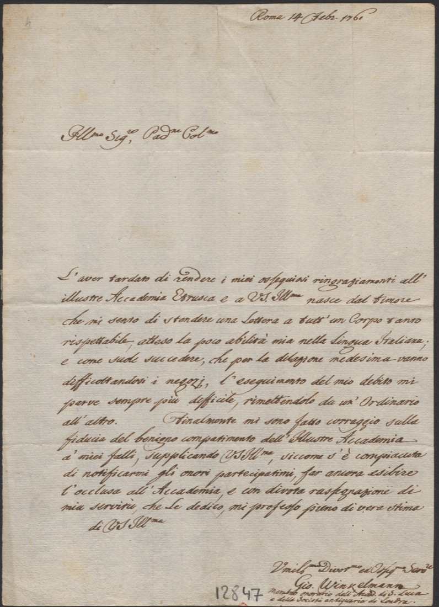

***
### **Lettre de « Giovanni Winkelmann, membro onorario dell’Acad. di S. Luca e della Società antiquaria di Londra » à Reginaldo Sellari, Rome, le 14 février 1761.**

-------------------------

**Bibliothèque de l’INHA, Autographe 28bis, 17**

[exemplaire numérisé](https://agorha.inha.fr/inhaprod/ark:/54721/00521717){:target="_blank"}

encre brune sur papier vergé (240 x  152 mm)
Au verso, en haut à droite : « al Canonico Antonio Sellari Segretario dell’Accademia Etrusca di Cortona »

En répondant avec retard au bibliothécaire et secrétaire de l’Académie étrusque de Cortone, l’avocat et chanoine Reginaldo Sellari (1718-1799), qui lui avait communiqué son élection comme membre, Winckelmann se justifie en disant qu’il avait plusieurs fois repoussé le moment de prendre la plume à cause de son niveau défaillant dans la rédaction en langue italienne. Ce qui est démenti par le contenu de la lettre. Le même jour, il écrivait aussi une lettre de remerciement aux « _Illustrissimi e Dottissimi Accademici_ » (Winckelmann 1961, p. 162).

Fondée en 1727 par un groupe de savants cortonais qui purent compter sur l’appui du grand-duc de Toscane, l’Académie étrusque était devenue un haut lieu de la culture antiquaire italienne et l’un des plus importants pour l’étude de la civilisation étrusque. Une riche bibliothèque, un cabinet ouvert au public, dont le catalogue fut publié en 1750, et un riche réseau de correspondants permirent à ses membres de nourrir des débats savants lors de leurs réunions hebdomadaires - les _Notti coritane_ - pendant une dizaine d’années, de 1744 à 1755. Y étaient admis les savants étrangers de passage et le contenu était systématiquement enregistré dans des comptes rendus manuscrits, aujourd’hui conservés dans les archives de l’académie. À partir de 1735, l’éditeur romain Pagliarini publia les _Saggi di dissertazioni accademiche pubblicamente lette nella nobile accademia Etrusca dell’antichissima città di Cortona_, que même Lalande mentionne dans son _Voyage d’un françois en Italie, fait dans les années 1765 & 1766_ comme « très-estimés des antiquaires » (nouvelle édition, t. VII, Yverdon, s. n., 1770, p. 221-222).

La candidature de Winckelmann avait été proposée par le nonce apostolique auprès du grand-duc de Toscane, Mgr Vitaliano Borromeo, à l’automne 1758. Il était alors _lucumone_ (président) de l’académie et avait connu Winckelmann à Florence lorsque ce dernier préparait le catalogue de la collection des pierres gravées du baron Philipp von Stosch [voir n°4](./document4.md). Cette élection prouvait que les érudits toscans reconnaissaient désormais le Saxon comme un des leurs. Winckelmann venait d’être élu aussi « _accademico d’onore_ » (membre honoraire) à l’Académie de Saint-Luc de Rome et membre de la Society of Antiquaries à Londres.

Une traduction française manuscrite et anonyme accompagne cet autographe.

DG

Biblio. : Winckelmann 1961, p. 117 (lettre du 7 octobre 1758) et 162-163, n° 59 (lettre du 14 février 1761) ; Barocchi-Gallo 1985 ; Fanfani 2016, p. 197.
