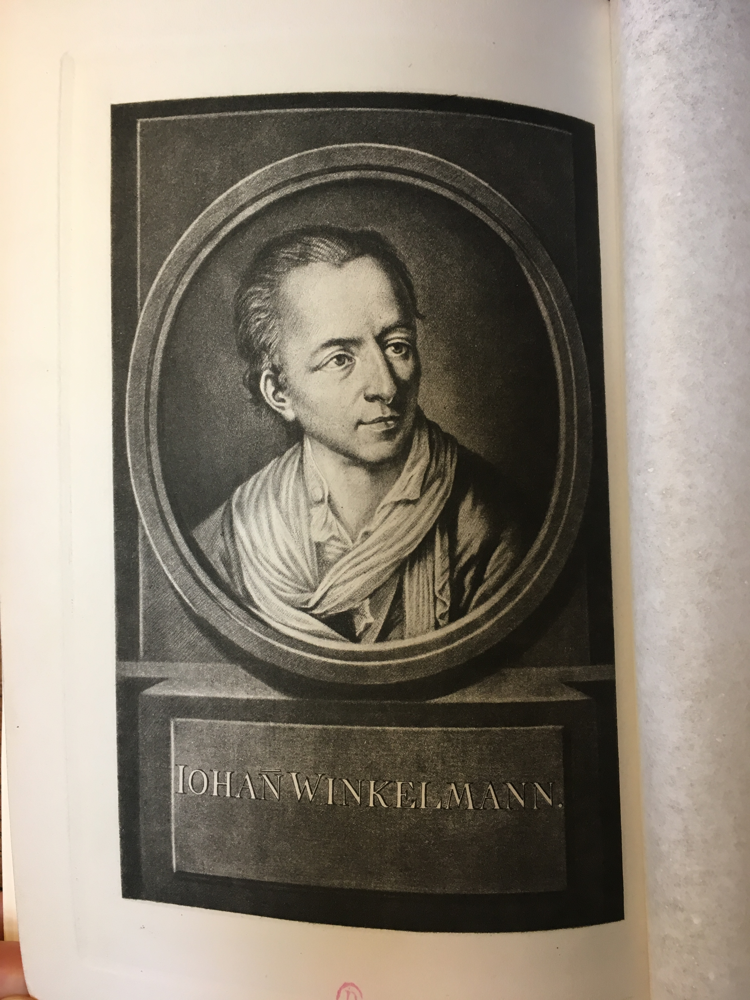
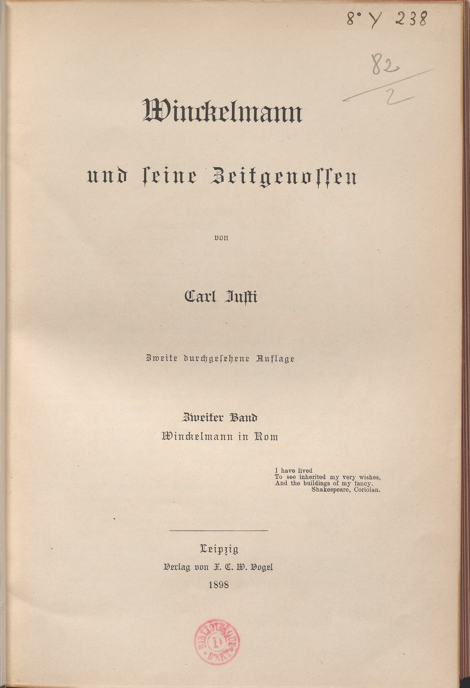

***
**Document n°13 - Carl Justi (1832-1912)**

**_Winckelmann und seine Zeitgenossen, Zweite durchgesehene Auflage, I, Winckelmann in Deutschland ; II, Winckelmann in Rom_**

**Leipzig, Verlag von F. C. W. Vogel, 1898**

**Bibliothèque de l’INHA, [cote N7483.W5 JUST 1898 (1)](http://bibliotheque.inha.fr/iguana/www.main.cls?surl=search#RecordId=1.117769){:target="_blank"}**

[exemplaire numérisé d'une autre bibliothèque](http://digi.ub.uni-heidelberg.de/diglit/justi1866bd1)

   

      <input name="carousel" class="carousel-open" id="carousel-1" aria-hidden="true" type="radio" hidden="true" Checked/>
      

      

      <input name="carousel" class="carousel-open" id="carousel-2" aria-hidden="true" type="radio" hidden="true"/>
      

  
      

      <input name="carousel" class="carousel-open" id="carousel-3" aria-hidden="true" type="radio" hidden="true"/>
      

      

      <label class="carousel-control prev control-1" for="carousel-3">‹</label>
      <label class="carousel-control next control-1" for="carousel-2">›</label>
      <label class="carousel-control prev control-2" for="carousel-1">‹</label>
      <label class="carousel-control next control-2" for="carousel-3">›</label>
      <label class="carousel-control prev control-3" for="carousel-2">‹</label>
      <label class="carousel-control next control-3" for="carousel-1">›</label>

      <ol class="carousel-indicators">
         <li>
            <label class="carousel-bullet" for="carousel-1">●</label>
            

              
            

         </li>
         <li>
            <label class="carousel-bullet" for="carousel-2">●</label>
            

              
            

          </li>  
         <li>
            <label class="carousel-bullet" for="carousel-3">●</label>
            

              
            

         </li>
    </ol>

***

1 volume in-8°
Reliure en tissu noir, dos avec pièce de titre en veau fauve, titre et nom de l’auteur dorés.
Frontispice avec portrait de Winckelmann dans un médaillon dans le vol. I ; dans le vol. II, portrait du cardinal Alessandro Albani exécuté par Marguerite Lecomte (1717-1800) à Rome en 1764.

***

Professeur d’histoire de l’art à l’université de Bonn de 1872 à 1901, Carl Justi (1832-1912) est l’auteur de quatre grandes monographies, celle sur Winckelmann, une sur Velázquez, parue en 1888 et immédiatement traduite en anglais (Londres, H. Grevel, 1889) et une troisième sur Murillo, éditée à Leipzig chez E. A. Seeman, en 1892. Il fut en effet l’un des premiers historiens de l’art allemands à s’intéresser à l’art espagnol du Siècle d’or. Son _Michelangelo : Beiträge zur Erklärung der Werke und des Menschen_ parut à Leipzig, chez Breitkopf et Härtel, en 1900. Il fut suivi neuf ans plus tard par un autre volume, _Michelangelo. Neue Beiträge zur Erklärung seiner Werke_.

Dès le début du XIXe siècle, le manque d’une vraie biographie de Winckelmann avait été plusieurs fois remarqué par ceux qui s’intéressaient à l’antiquaire ([voir notice n°12](./document12.md)), le _Winckelmann und sein Jahrhundert in Briefen und Aufsätzen_ édité par Goethe en 1805 à Tübingen chez le libraire J. C. Cotta avec les contributions de Goethe lui-même, d’Heinrich Meyer (1760-1832), de Friedrich August Wolf (1759-1824) et de Carl Ludwig Fernow (1763-1808) - les amis de Weimar - ne suffisant pas à combler cette lacune. Justi lut les écrit de Winckelmann à Marbourg, sa ville natale, où il était revenu après la soutenance de sa thèse en philosophie à Berlin en 1859. Sur les pas de Winckelmann, il voyagea ensuite en Italie, séjournant en particulier à Rome, où il découvrit le portrait d’Innocent X par Velázquez (palais Doria-Pamphilj), ce qui le décida à s’intéresser au peintre espagnol. Il vint aussi à Paris, où, à la Bibliothèque nationale, il consulta les papiers de l’antiquaire arrivés au moment des saisies napoléoniennes. La première édition de son ouvrage, en deux volumes (le second est en deux parties), intitulé _Winckelmann in Italien mit Skizzen zur Kunst und Gelehrtengeschichte des achzehnten Jahrhunderts_ parut à Leipzig, chez Vogel, entre 1866 et 1872. Cette deuxième édition augmentée et publiée en 1898 chez le même éditeur est en trois volumes. Devenue rapidement un classique, la biographie de Winckelmann par Justi fit l’objet de plusieurs éditions allemandes, mais elle n’a jamais été traduite. La quatrième édition, parue en 1943 à Leipzig chez Koehler & Amelang, est enrichie d’une introduction de Ludwig Curtius (1874-1954) sur « Carl Justi und sein ‘Winckelmann’ » (p. V-XXXIII). L’apport de Justi y est contextualisé en l’insérant dans le mouvement de _Kulturwissenschaft_ qui caractérisa les recherches historiques de langue allemande du tournant du XIXe siècle. Curtius relève aussi combien les pages de Justi doivent à la littérature britannique -  romanesque ou historique - du XIXe siècle, à la théorie du milieu d’Auguste Comte et aux travaux de Sainte-Beuve et de Taine. Sa biographie de l’antiquaire saxon est donc autant un monument d’histoire culturelle que d’histoire sociale. En 1983, cette quatrième édition du Winckelmann de Justi, qui est enrichie d’une utile mise à jour bibliographique et d’un index, a fait l’objet d’une édition anastatique en deux volumes par l'éditeur Georg Olms.

Lors de ses recherches sur l’antiquaire, Justi avait retrouvé, entre autres, la correspondance du baron Philipp von Stosch, après la mort duquel Winckelmann rédigea le catalogue de la collection de pierres gravées et d’estampes ([voir notice n°4](./document4.md)). Il publia cette correspondance en 1871 à Marbourg, chez C. L. Pfeilii, sous le titre _Antiquarische Briefe des Baron Philipp von Stosch_.

DG

Biblio. : Rößler 2014 ; Lehmann 2016.
