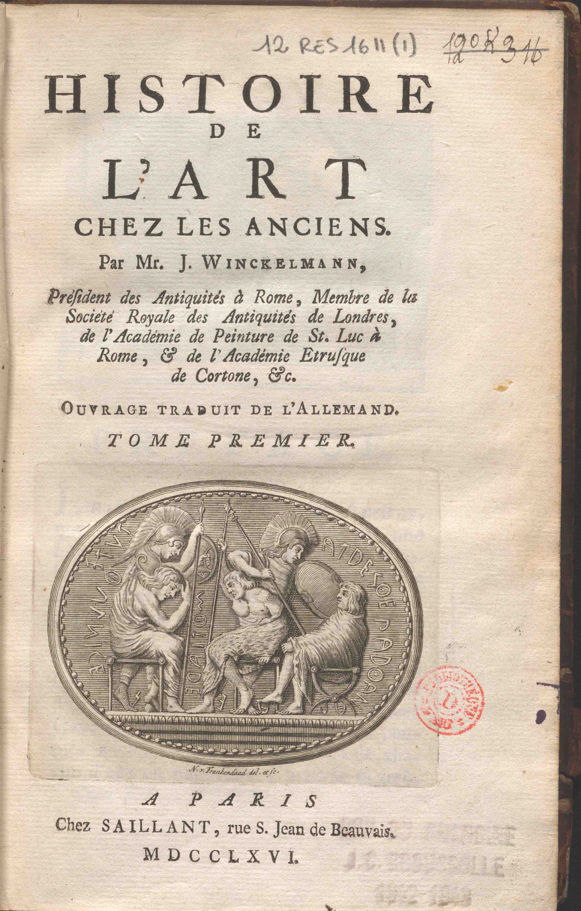
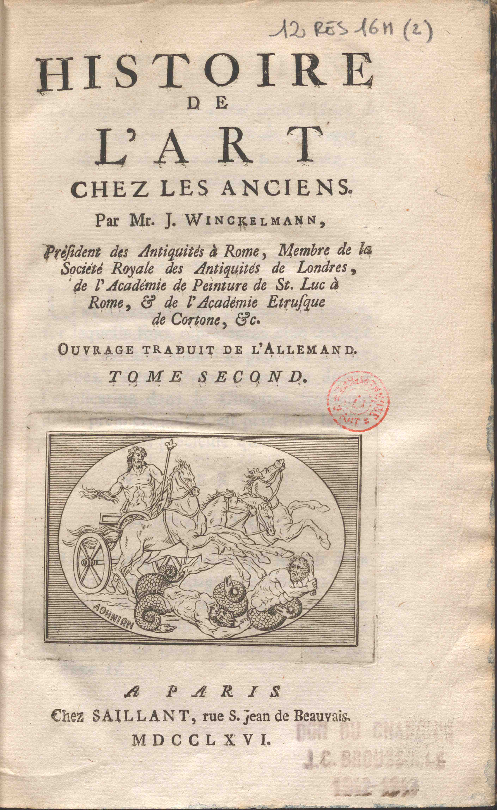

***

**Document n°15 - Johann Joachim Winckelmann (1717-1768)**

**_Histoire de l’Art chez les Anciens par Mr. J. Winckelmann, Président des Antiquités à Rome, Membre de la Société Royale des Antiquités de Londres, de l’Académie de Peinture de St. Luc à Rome, & de l’Académie Etrusque de Cortone, ouvrage traduit de l'allemand_**

**Paris, chez  Saillant, rue S. Jean de  Beauvais, 1766**

**Bibliothèque de l’INHA, [cote 12 RES 1611 (1-2)](http://bibliotheque.inha.fr/iguana/www.main.cls?surl=search#RecordId=1.264250){:target="_blank"}**

[exemplaire numérisé d'une autre bibliothèque](https://gallica.bnf.fr/ark:/12148/bpt6k6423247r)

   

      <input name="carousel" class="carousel-open" id="carousel-1" aria-hidden="true" type="radio" hidden="true" Checked/>
      

      

      <input name="carousel" class="carousel-open" id="carousel-2" aria-hidden="true" type="radio" hidden="true"/>
      

  
      

      <input name="carousel" class="carousel-open" id="carousel-3" aria-hidden="true" type="radio" hidden="true"/>
      

      

      <label class="carousel-control prev control-1" for="carousel-3">‹</label>
      <label class="carousel-control next control-1" for="carousel-2">›</label>
      <label class="carousel-control prev control-2" for="carousel-1">‹</label>
      <label class="carousel-control next control-2" for="carousel-3">›</label>

      <ol class="carousel-indicators">
         <li>
            <label class="carousel-bullet" for="carousel-1">●</label>
            

              
            

         </li>
         <li>
            <label class="carousel-bullet" for="carousel-2">●</label>
            

              
            

          </li>  

    </ol>

***

2 volumes in-12°(20 x 13 cm)
Reliure en veau brun marbré, dos orné et doré à huit nerfs avec pièce de titre et tomaison.
Cachet sur la page de titre : « Don du chanoine J. C. Broussolle 1942-1943 »

***

Parue à Dresde en 1764 chez l’éditeur Walther en un volume in-4°, la _Geschichte der Kunst des Alterthums_ de Johann Joachim Winckelmann avait été pensée et rédigée à Rome, où peu nombreux étaient ceux qui maniaient avec aisance la langue allemande. Dès 1757, l’antiquaire avait en effet nourri le projet de traduire son futur livre en italien, le cardinal Alessandro Albani étant disposé à prendre en charge le coût de l’édition (lettre de Winckelmann à Giovanni Ludovico Bianconi du 16 avril 1757 et lettre à Johann Georg Wille du 14 juin 1760, dans Winckelmann 1952-1957, III, p. 398 ; et II, p. 89). Mais ce projet n’eut pas de suite du vivant de l’auteur. Ainsi, à l’insu de Winckelmann, deux ans après la sortie de la _Geschichte_ à Dresde paraissait à Paris, chez Saillant, et à Amsterdam, chez E. van Harrevelt, cette traduction française - la première. Elle était l’œuvre de Gottfried Sellius (1704-1767), un ancien professeur de droit à Halle installé à Paris depuis les années 1740, et de Jean-Baptiste René Robinet de Chateaugiron (1735-1820), lequel avait assuré le suivi éditorial. Bien qu’immédiatement désavouée par l’antiquaire, qui avait essayé en vain d’en empêcher la parution car il estimait qu’elle ne rendait pas exactement sa pensée et qu’elle aurait nécessité quelques mises à jour, elle fit connaître en Europe le contenu de ce texte important, considéré depuis comme un jalon essentiel dans l’histoire de l’histoire de l’art. Au fil des mois, la fureur de Winckelmann s'éteignit un peu. Néanmoins, début 1767, il demanda à l’architecte saxon Friedrich Wilhelm Ermannsdorf (1736-1800) de lui préparer une « explication » destinée à la presse anglaise car, dans la traduction de Sellius et Robinet, il est écrit que « la capacité naturelle des Anglois pour l’Art […] se réduit à très peu de chose, pour ne pas dire à rien du tout » (I, p. 46-47). Or cette phrase avait suscité des remous chez les Britanniques de Rome, lesquels lisaient donc l’ouvrage dans la traduction française. En fait, Winckelmann n’était pas seulement déçu par cette traduction en tant qu’auteur, mais il craignait aussi, à juste titre, que l’édition Walther ne se vendît pas bien.

Les vignettes qui décorent les pages de titre des deux volumes de cette traduction sont celles de l’édition Walther, mais, ici, la gravure du volume I est signée « N y Frankendaad del. et sc. » - alors que dans l’édition allemande elle portait la signature de Johann Adam Schweickart (1722-1787)— et celle du volume II est anonyme, tandis que dans l’édition allemande elle était signée par Michael Keyl (1722-1798). Elles reproduisent respectivement une cornaline étrusque du début du Ve s. av. J.-C. avec cinq héros des « Sept contre Thèbes » de la collection du baron Stosch (voir n° 4), une intaille trouvée près de Pérouse vers 1742 et alors connue comme « _gemma Ansidei_ » du nom de son premier propriétaire, le comte Vincenzo Ansidei. Elle est aujourd’hui conservée à l’Antikensammlung de Berlin (n° inv. FG 194). Dans le volume II, est en revanche reproduit un camée en agate sardoine de la collection Farnèse (auparavant chez les Orsini) signé « Athénion » et représentant Jupiter foudroyant des géants. Ce magnifique camée est conservé au Musée archéologique de Naples (n° inv. 25848).

Le donateur de cet exemplaire de la bibliothèque de l’INHA, Jacques-Camille Broussolle (1861-1943), avait été chanoine de la cathédrale de Paris. Il est l’auteur, entre autres, d’une monographie illustrée sur _La jeunesse de Pérugin_ et les origines de l’école ombrienne (Paris, H. Oudin, 1901) préfacée par Huysmans, qui fit l’objet de comptes rendus par Eugène Müntz et par Émile Mâle respectivement dans _la Gazette des Beaux-Arts_ et dans _la Revue de l’art_. Le chanoine possédait de nombreux livres sur l’art et l’histoire italiens au Moyen-Âge et à la Renaissance et sur les sources de l’histoire de l’art, qui font désormais partie des fonds de la bibliothèque de l’INHA.

DG

Biblio. : Espagne 1991, p. 103-106 ; Griener 1998 ; Ferrari 2011, p 15-27 ; Kunze 2016.

