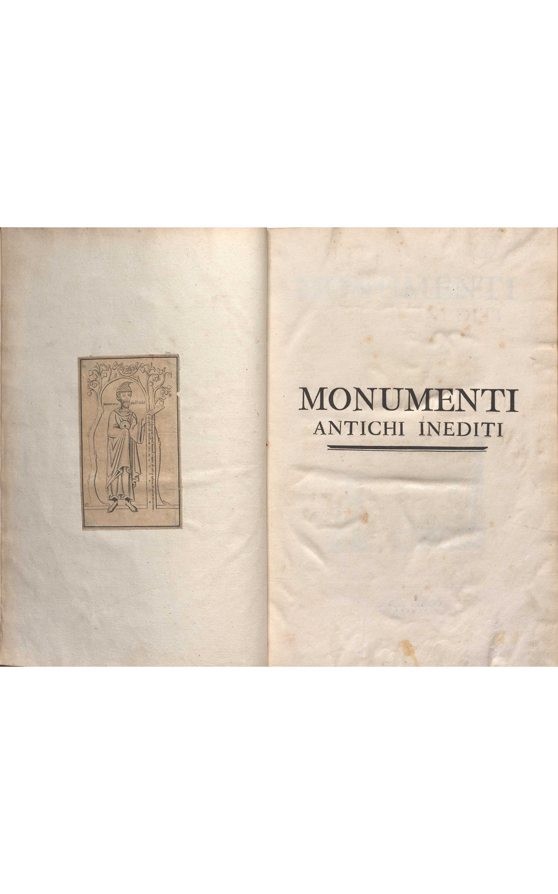

***

**Document n°18 - Johann Joachim Winckelmann**

**_Monumenti antichi inediti_**

**Rome, A spese dell' autore, 1767**

**Bibliothèque de l'INHA, cote [Fol RES 355 (1-2)](http://bibliotheque.inha.fr/iguana/www.main.cls?surl=search#RecordId=1.227708)**

[Exemplaire numérisé d'une autre bibliothèque](http://digi.ub.uni-heidelberg.de/diglit/winckelmann1767ga)

   

      <input name="carousel" class="carousel-open" id="carousel-1" aria-hidden="true" type="radio" hidden="true" Checked/>
      

      

      <input name="carousel" class="carousel-open" id="carousel-2" aria-hidden="true" type="radio" hidden="true"/>
      

  
      

      <input name="carousel" class="carousel-open" id="carousel-3" aria-hidden="true" type="radio" hidden="true"/>
      

      

      <label class="carousel-control prev control-1" for="carousel-3">‹</label>
      <label class="carousel-control next control-1" for="carousel-2">›</label>
      <label class="carousel-control prev control-2" for="carousel-1">‹</label>
      <label class="carousel-control next control-2" for="carousel-3">›</label>
      <label class="carousel-control prev control-3" for="carousel-2">‹</label>
      <label class="carousel-control next control-3" for="carousel-1">›</label>

      <ol class="carousel-indicators">
         <li>
            <label class="carousel-bullet" for="carousel-1">●</label>
            

              
            

         </li>
         <li>
            <label class="carousel-bullet" for="carousel-2">●</label>
            

              
            

          </li>  
         <li>
            <label class="carousel-bullet" for="carousel-3">●</label>
            

              
            

         </li>
    </ol>

***

1 volume  in-folio (39 x 28 cm)

Reliure en veau brun (avec décor de croisillons estampé), encadrement doré sur les plats avec au centre du premier plat de chaque volume des armes frappées or avec la devise _Pro Rige et Patria_  et le monogramme C.C.A.M.I.R., dos à cinq nerfs cloisonné de filets dorés, titre et tomaison.

Page de titre : marque _Charles Cameron C.C.A.M.I.R._ sur le volume 1 : papier collé sur une page blanche avec le titre _Honorius phil. Folu._ (?) Gravure collée sur la dernière page, avec à l’encre en dessous : _monumens inedis Vedi, parte seconda, pag.134._

***

Cet ouvrage, la dernière publication d’envergure de Winckelmann, parut en février 1767 ; c’est pourtant celui par lequel le savant allemand s’inscrivit le plus clairement dans la tradition antiquaire. Il s’agissait sans doute pour lui de convaincre un lectorat romain sensible à la forme du recueil illustré d’antiquités avec un large apparat critique, et qui ne connaissait pas bien ses livres en allemand (ou même en français). Le projet d’un recueil en italien regroupant les explications de monuments inédits était annoncé imminente en 1764 dans la Geschichte : en effet, Winckelmann y travailla dès 1760. Le projet évolua, et les deux volumes furent finalement édité par l’auteur lui-même, qui travailla d’emblée à un troisième volume dont le manuscrit est aujourd’hui conservé à la bibliothèque de Montpellier (_Osservazioni ed estratti di antichità_).

La première partie est constituée d’un traité préliminaire, qui est une sorte de synthèse de l’_Histoire de l’art de l’antiquité_, expurgée des passages contenant les considérations politiques sur la liberté les plus osées pour un public italien. Viennent ensuite 208 planches le plus souvent doubles, puis leur explication dans un deuxième volume (ce qui permet de mettre en regard l’image et son explication). Les illustrations (auxquelles s’ajoutent dix-huit vignettes de titre de chapitre) sont donc, contrairement aux publications précédentes de l’auteur, très abondantes. Les dessins, qui devaient au départ du projet être entièrement confiés à Giovanni Battista Casanova (1730-1795), furent finalement commandés à différents artistes.

Les œuvres proviennent de multiples collections privées ou de musées publics, dont la liste est publiée ; la collection Albani y tient une place de premier choix (106 objets sur les 491 publiés). Elles sont classées par leur représentation, en commençant de manière classique par la mythologie, à qui Winckelmann assignait une place essentielle. Il affirmait en effet avoir suivi dans cet ouvrage deux principes pour ses analyses : poser comme postulat la place centrale, sinon exclusive, de la mythologie grecque comme choix de sujet par les artistes antiques ; étudier les œuvres sous cette problématique. Il se positionna ainsi notamment contre le primat accordé à l’histoire romaine dans certaines lectures de son temps, et proposa une méthode d’interprétation unitaire pour des œuvres antiques disparates.

Le format de l’ouvrage, rapidement traduit en Français et en Allemand et réédité en Italien en 1821, fit des émules : Aubin-Louis Millin et ses _Monumens antiques inédits ou nouvellement expliqués_ (1802-1806), _Les Monuments inédits d'antiquité figurée, grecque, étrusque et romaine_ de Désiré Raoul-Rochette (1833), et bien sûr la série des _Monumenti inediti pubblicati dall'Instituto di corrispondenza archeologica_ à partir de 1829.

Cet exemplaire a appartenu à l’architecte et dessinateur écossais Charles Cameron (1743-1812), nommé en 1779 architecte de Catherine II de Russie (ce que signifient les initiales : _Charles Cameron Architectus Majestatis Imperiale Russiæ_

). Il a créé de nombreux bâtiments et intérieurs de style néo-classique, comme dans la résidence impériale de Tsarskoye Selo (palais Catherine) avec les appartements de l’impératrice, les chambres d'Agathe, les jardins suspendus, les bains froids et la galerie Cameron. Une gravure supplémentaire a été insérée à la fin du volume I, portant l’image d’une statue fragmentaire du Minotaure placée sur un autel. Cette œuvre est mentionnée dans le texte mais non reproduite dans l’ouvrage (II, p.134, alors chez le sculpteur et marchand Bartolomeo Cavaceppi, qui le vendra au Vatican - aujourd’hui Museo Pio-Clementino, inv. 461).

CC

Biblio. : Winckelmann 2011-2014 ; Ferrari, Ossanna Cavadini 2017 ; Disselkamp - Testa 2017, p.249-256.

