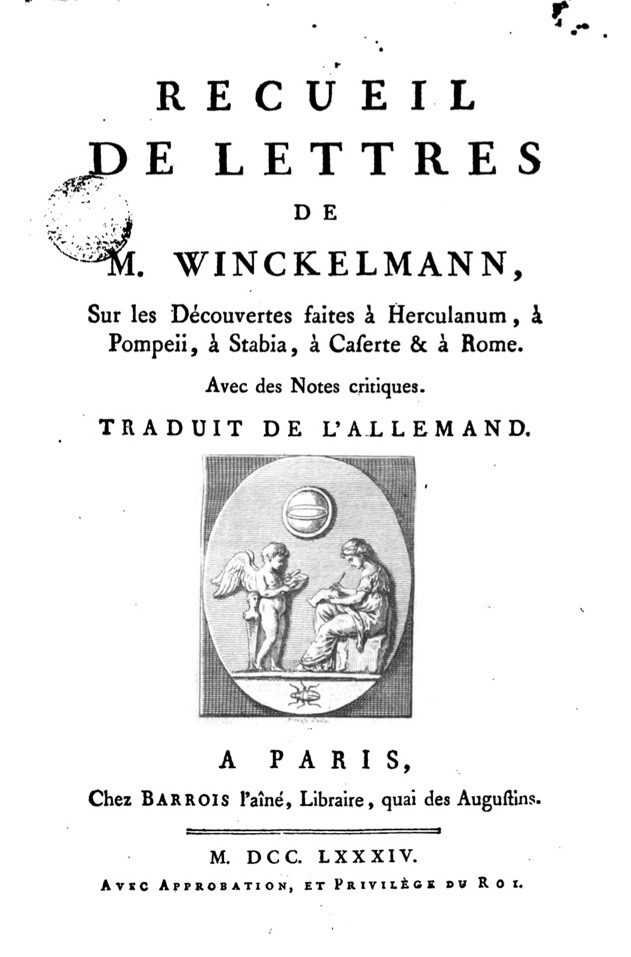

***

**Document n°19 - Johann Joachim Winckelmann (1717-1768)**

**_Recueil de lettres de M. Winckelmann, sur les découvertes faites à Herculanum, à Pompéii, à Stabia, à Caserte & à Rome_**

**Paris, chez Barrois l'aîné, libraire, quai des Augustins, 1784**

**Bibliothèque de l'INHA, cote 8 RES 855 et 8 RES 856**

[Consulter le document numérisé](http://bibliotheque-numerique.inha.fr/idurl/1/13540){:target="_blank"}

1 volume in-octavo (21 x 13 cm)

Reliure de veau brun marbré, dos orné avec pièce de titre. 8 RES 855 : Ex-libris impr. _Giannalisa Feltrinelli._ Rel. avec _Remarques sur l'architecture des anciens, par M. Winckelmann, président des Antiquités du Vatican, Paris, Barrois, 1783_

***

Ce recueil comprend trois écrits de Winckelmann sur les découvertes des sites antiques de Campanie : _Lettre de M. l’abbé Winckelmann à M. le comte de Brühl, sur les découvertes d’Herculanum (Sendschreiben von den Herculanischen Entdeckungen an den Hochgebohrnen Herrn Heinrich Reichsgrafen von Brühl_, 1762) ; _Relation des nouvelles découvertes faites à Herculanum, adressées à M. Henri Fuessli, de Zurich (Nachricht von den neuesten Herculanischen Entdeckungen_, 1764) ; _Seize lettres de M. Winckelmann à M. Bianconi, conseiller et résident de la Cour électorale de Saxe auprès du Pape ; sur les découvertes faites à Herculanum, à Pompeii, à Stabia, à Pestum, à Caserte et à Rome, avec des remarques et des notes de M. Dassdorf, bibliothécaire de la bibliothèque électorale à Dresde_. Il s’agit donc de trois ensembles de lettres, adressées respectivement à Heinrich von Brühl (1700-1763), premier ministre d’Auguste III de Pologne, le peintre suisse Johann Heinrich Füssli (1745-1832) et l’antiquaire italien Giovanni
Ludovico Bianconi (1717-1781), archidiacre à la cour de Dresde. Le dernier est en fait le plus ancien, et documente le premier voyage de 1758 ; les deux premières témoignent de visites avec les destinataires et ont été publiés d’emblée en allemand en 1762 et 1764. Le premier opus fut traduit en français dès 1764 par Michael Huber, un savant allemand vivant à Paris (voir *n°16*), témoignant de la demande des lecteurs européens vis-à-vis des ces fameuses collections campaniennes.

En effet, la découverte et les fouilles des sites d’Herculanum dès 1738, puis de Pompéi à partir de 1748, marquèrent profondément les esprits et ont drastiquement changé les connaissances sur l’antiquité, en mettant au jour un riche ensemble de mobilier, de sculptures et de peintures, enfouis lors de l’éruption du Vésuve de 79. Les deux sites sont situés en Campanie, dans le royaume de Naples. Très vite, ils devinrent l’objet de la curiosité de l’Europe entière, et amateurs, artistes et collectionneurs affluaient pour voir ces merveilles fraîchement sorties de terre. L’attrait était d’autant plus fort que les rois bourbons veillaient jalousement à contrôler les informations et publications, et accordaient avec parcimonie le droit de visiter les fouilles et le musée royal installé à Portici ; il y était de plus interdit de prendre des notes ou de dessiner les œuvres, la publication étant normalement réservée aux luxueux volumes _in-folio_, les _Antichità di Ercolano_, édités à partir de 1757.

Winckelmann détourna en quelques-sortes cet interdit par ces lettres (qui ne comportent cependant aucune illustration). Il visita Naples et les sites de Campanie à quatre reprises, en 1758, 1762, 1764 et 1767, et il y examina en détail les collections réunies au musée de Portici. Les comptes-rendus qu’il rédigea montrent l’étendue de ses intérêts. S’il accorda beaucoup de temps à décrire les œuvres découvertes, aussi bien les peintures et les sculptures que les _papyri_ et inscriptions et les modestes objets de la vie quotidienne dont on découvrait pour la première fois l’existence, on trouve aussi des considérations sur la vulcanologie, la topographie, la papyrologie, la muséographie, ou la conservation des œuvres issues de terre. De manière assez ingrate, Winckelmann se montra aussi très critique envers les savants de Naples qui l’avaient tenu parfois secrètement au courant des découvertes récentes, et des fouilles qui s’apparentaient parfois au pillage.

L’ouvrage a appartenu à la célèbre bibliothèque milanaise de Gianna Elisa Gianzana Feltrinelli, la mère de l’éditeur Giangiacomo.

CC

Bibliographie : Winckelmann 1997-2001 ; Winckelmann 2011 ; Ferrari 2015 ; Disselkamp - Testa 2017, p.164-179.
