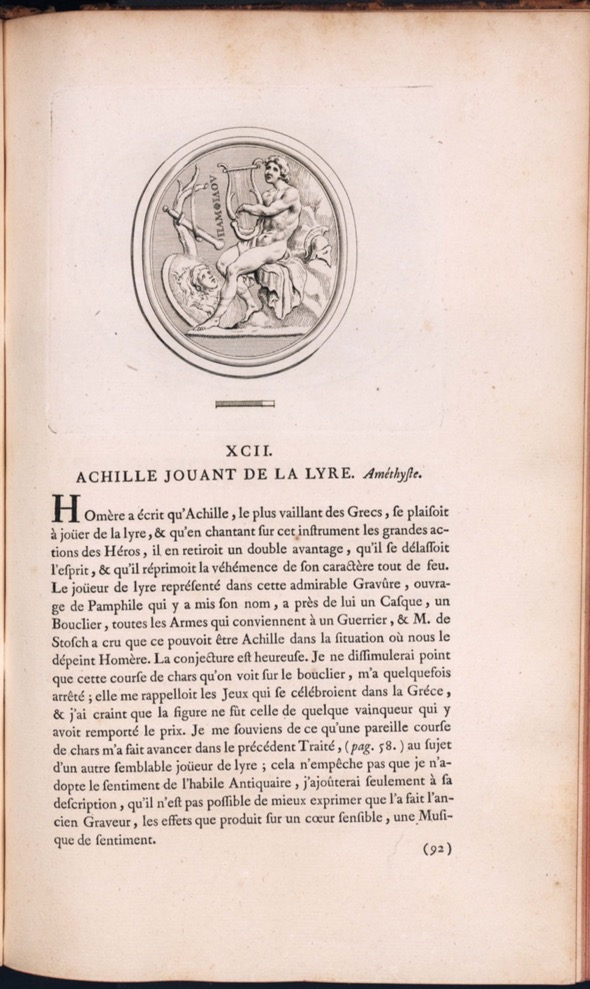

***

**Document n°2 - Pierre-Jean Mariette (1694-1774)**

**_Traité des pierres gravées_**

**Paris, chez P.J. Mariette, 1750**

**Bibliothèque de l'INHA, [cote 4 RES 504 (1-2)](http://bibliotheque.inha.fr/iguana/www.main.cls?surl=search#RecordId=1.227111)**

[Exemplaire numérisé d'une autre bibliothèque](https://gallica.bnf.fr/ark:/12148/bpt6k311112h)

   

      <input name="carousel" class="carousel-open" id="carousel-1" aria-hidden="true" type="radio" hidden="true" Checked/>
      

      

      <input name="carousel" class="carousel-open" id="carousel-2" aria-hidden="true" type="radio" hidden="true"/>
      

  
      

      <input name="carousel" class="carousel-open" id="carousel-3" aria-hidden="true" type="radio" hidden="true"/>
      

      

      <label class="carousel-control prev control-1" for="carousel-3">‹</label>
      <label class="carousel-control next control-1" for="carousel-2">›</label>
      <label class="carousel-control prev control-2" for="carousel-1">‹</label>
      <label class="carousel-control next control-2" for="carousel-3">›</label>
      <label class="carousel-control prev control-3" for="carousel-2">‹</label>
      <label class="carousel-control next control-3" for="carousel-1">›</label>

      <ol class="carousel-indicators">
         <li>
            <label class="carousel-bullet" for="carousel-1">●</label>
            

              
            

         </li>
         <li>
            <label class="carousel-bullet" for="carousel-2">●</label>
            

              
            

          </li>  
         <li>
            <label class="carousel-bullet" for="carousel-3">●</label>
            

              
            

         </li>
    </ol>

***
2 volumes in-quarto (33 x 22 cm)

Reliure en maroquin rouge, encadrement doré sur les plats, dos à cinq nerfs cloisonné de filets dorés, titre et tomaison.

Première page mention à l’encre : _1877. collationné complet le 6 juillet 1825. J.J. Debure l’ainé. la feuille 6 du tome second est double. en bas c.d.m.m. 689_

***

Pierre-Jean Mariette est une des grandes figures de la République des Lettres à Paris au XVIIIe siècle.
Né dans une importante famille de graveurs et éditeurs d’estampes de la rue Saint-Jacques, il apprend le dessin et la gravure avec Jean Chaufourier (1679-1757)
et devient libraire-éditeur en 1714 et imprimeur en 1722.

Il effectue un grand voyage entre 1717 et 1719 qui l’emmène à Amsterdam, en Allemagne, à Vienne (où il dresse le catalogue de la collection d’art du prince Eugène de Savoie) et en Italie.
A son retour à Paris, il fréquente avec son ami le comte de Caylus le fameux salon du collectionneur d’art Pierre Crozat (1661-1740) ;
il collabore ainsi au projet du _Recueil Crozat_, et c’est lui qui dresse à la mort du collectionneur un catalogue raisonné de ses dessins qui devient une référence en matière
de méthode et de précision. Il fut rapidement un des premiers éditeurs et marchands d’estampes en Europe, et la fortune qu’il constitue
lui permet à la fois d’enrichir les collections familiales, et de se retirer du métier pour se consacrer à  l’étude de l’art
et être un vrai _connaisseur_ en 1750, année où il fut élu associé libre de l’Académie royale de peinture et de sculpture.

Cette même année paraît son _Traité des pierre gravées_, un ouvrage qui fait date.
Mariette et Caylus ont commencé à travailler à une publication des pierres gravées du Cabinet royal, conservé à Versailles, dès les années 1720 ;
leur intérêt pour ces collections est peut-être lié à la proximité technique de la glyptique, ou gravure sur pierre fine, avec la gravure sur cuivre des estampes.
L’ouvrage finalement publié contient effectivement dans la deuxième partie un catalogue, qui s’inscrit donc dans la même veine que l’ouvrage précédent de Gori (document 1).
Mais l’apport le plus original est sans doute le Traité de la première partie : Mariette brosse une histoire de l’art de la glyptique depuis son origine jusqu’à l’époque moderne.
Il y expose la méthode rigoureuse à appliquer à l’étude des antiquités, et cherche à déterminer le _goût des nations._

en établissant un lien entre le progrès de l’art de la glyptique et l’état de chaque civilisation.
Il fournit aussi une sorte de manuel pour l’amateur, expliquant la fabrication des pierres, la manière d’en faire des reproductions ou des empreintes, et donnant les ouvrages nécessaires à une _bibliothèque dactylographique._

Le second volume se présente plus classiquement sous la forme d’un recueil des pierres du Cabinet du Roi : chaque intaille est reproduite puis décrite et commentée.
Si l’ouvrage est signé de Mariette, il est très certainement une œuvre collective, et a bénéficié des idées de Caylus
comme d’Antonio Cocchi (1695-1758), le conservateur de la galerie des Offices de Florence, et sans doute de divers membres de l’Académie de Inscriptions et belles-lettres.
D’ailleurs, les textes ne suivent pas toujours les méthodes d’analyse et de classification prônées dans le traité du volume un. Pour Mariette, la qualité des reproductions
est essentielle pour faire sentir le style antique : il confie les dessins à un seul artiste, Edmé Bouchardon (1698-1762), dont il pense que la qualité de sculpteur
prédispose particulièrement à comprendre l’art des pierres gravées, et à le rendre au trait. Le choix de faire appel à un des artistes les plus renommés de son temps, chez qui
l’influence de l’antique est déterminante, est révélateur de la prééminence désormais accordée au style dans l’approche des œuvres antiques.
Cet ouvrage, qui loue la simplicité du style le plus élevé ou fait la promotion de l’art grec contre l’art romain (vu comme un art de copistes), propose des idées semblables
à celles développées quelques années plus tard par Winckelmann.

CC

Bibliographie : Pomian 2000 ; Occhipinti 2013 ; Occhipinti 2017 ; Smentek 2017 ; Kobi 2017

