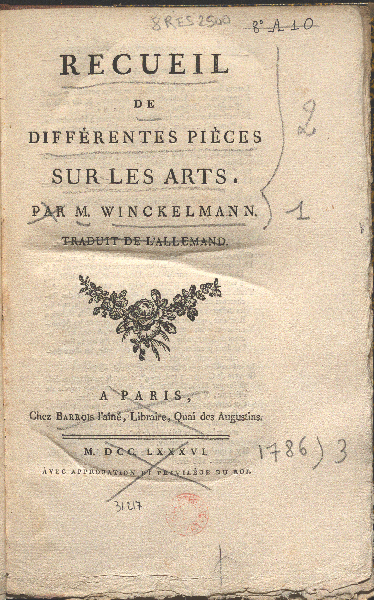

***

**Document n°20 - Johann Joachim Winckelmann (1717-1768)**

**_Recueil de différentes pièces sur les arts_**

**Paris, chez Barrois l'aîné, libraire, quai des Augustins, 1786**

**Bibliothèque de l'INHA, cote 8 RES 1221 et 8 RES 2500**

[Consulter le document numérisé](http://bibliotheque.inha.fr/iguana/www.main.cls?surl=search#RecordId=1.227402)

[Exemplaire numérisé d'une autre bibliothèque](https://gallica.bnf.fr/ark:/12148/bpt6k84160q)

   

      <input name="carousel" class="carousel-open" id="carousel-1" aria-hidden="true" type="radio" hidden="true" Checked/>
      

      

      <input name="carousel" class="carousel-open" id="carousel-2" aria-hidden="true" type="radio" hidden="true"/>
      

  
      

      <input name="carousel" class="carousel-open" id="carousel-3" aria-hidden="true" type="radio" hidden="true"/>
      

      

      <label class="carousel-control prev control-1" for="carousel-3">‹</label>
      <label class="carousel-control next control-1" for="carousel-2">›</label>
      <label class="carousel-control prev control-2" for="carousel-1">‹</label>
      <label class="carousel-control next control-2" for="carousel-3">›</label>
      <label class="carousel-control prev control-3" for="carousel-2">‹</label>
      <label class="carousel-control next control-3" for="carousel-1">›</label>

      <ol class="carousel-indicators">
         <li>
            <label class="carousel-bullet" for="carousel-1">●</label>
            

              
            

         </li>
         <li>
            <label class="carousel-bullet" for="carousel-2">●</label>
            

              
            

          </li>  
         <li>
            <label class="carousel-bullet" for="carousel-3">●</label>
            

              
            

         </li>
    </ol>

***

1 volume in-octavo (21 x 15 cm).

8 RES 1221 : reliure veau fauve, dos orné avec pièce de titre. Estampille sur la page de titre : _Bibliothèque d'art et d'archéologie, 19 rue Spontini, 19 Paris._ 8 RES 2500 : reliure moderne (tampon M. Teinturier relieur), inv. 31.217 ; cachet au faux-titre : _Don de M. Louis Dimier_ ; annoté au crayon à papier.

***

Cet ouvrage de 1786 proposa au public francophone la réunion de plusieurs publications de Winckelmann. La première, _Réflexions sur l’imitation des artistes grecques dans la peinture et la sculpture_, est une nouvelle traduction des _Gedanken über die Nachahmung der griechischen Werke in der Malerei und Bildhauerkunst_, parus en 1755 à Dresde. Il existait déjà une traduction en français sous forme de lettres, à partir d’une version anglaise, mais selon l’auteur elle comportait des erreurs et des omissions. Le traducteur (sans doute Hendrik Jansen, 1741-1812, *voir n° 11 et 17*) est reparti de ce travail en le corrigeant et en ajoutant les changements de la seconde édition allemande publiée à Dresde et Leipzig en 1756.

Elle est accompagnée de trois textes qui étaient ajoutés à cette deuxième édition : une réplique, que l’on pense maintenant fictive : _Lettre à M. Winckelmann, au sujet de ses réflexions sur l'imitation des artistes grecs dans la peinture et la sculpture (Sendschreiben über die Gedanken)_, une _Description de deux momies du cabinet électoral d'antiquités, à Dresde_, et la réponse _Éclaircissements sur un écrit intitulé : réflexions sur l'imitation des artistes grecs dans la peinture et la sculpture ; pour servir de réponse à une lettre sur ces réflexions (Erlaüterung der Gedanken)_. Il semble que ces textes aient en fait été tous écrits par Winckelmann lui-même, qui attira ainsi l’attention sur ses écrits en créant la polémique et en assura la diffusion. En effet, ce premier livre publié quand il était encore à Dresde est celui qui a rendu célèbres ses idées, avec quelques formules qui sont passées à la postérité. _Ce n’est qu’en imitant les Anciens qu’on peut parvenir à exceller, et même à devenir inimitable._ : les artistes grecs, en imitant la nature et les beaux corps des jeunes grecs, auraient atteint pour Winckelmann une perfection dans les arts, dont les artistes auraient tout bénéfice à s’inspirer pour s’éloigner du style baroque par _une noble simplicité et une grandeur tranquille._

Le texte suivant est la traduction d’un écrit posthume, paru en 1769, _Réflexions sur le sentiment du beau dans les ouvrages de l'art, et sur les moyens de l'acquérir (Abhandlung von der Fähigkeit der Empfindung des Schönen in der Kunst und dem Unterrichte in derselben_). Il s’agit d’un texte envoyé au baron de Berg en 1763, organisé en deux parties : _notre aptitude naturelle à connaître le beau._ et _les instructions nécessaires pour l’acquérir._

Winckelmann y prônait comme éducation la fréquentation des œuvres représentatives du plus bel art, soit par l’intermédiaire des publications disponibles (sont citées celles de Pietro Sante Bartoli (1635-1700), les reproductions des bas reliefs et peintures antiques, et des œuvres de Raphaël, 1483-1520), soit par le contact direct avec les œuvres antiques dans la mesure du possible.

Enfin est proposé un court ouvrage de 1759, _De la grâce dans les ouvrages de l'art (Von der Grazie in Werken der Kunst_), qui commence ainsi : _La grâce est ce qui plaît à l’esprit. (…) Elle ne fait qu’annoncer la disposition qu’ont les objets à être beaux._

Le recueil offre donc la réunion des œuvres de Winckelmann qui traitent de plus directement de questions philosophiques et esthétiques : l’Art, le Beau, la Grâce.

La bibliothèque de l’INHA possède deux exemplaires de cet ouvrage : si le premier, dans une belle reliure XVIIIe siècle, a été acheté pour la bibliothèque Doucet de la rue Spontini, l’autre fait partie du don posthume des collections de l’historien d’art Louis Dimier (1865-1943 - voir aussi *n°17*). Son principal intérêt réside dans les nombreuses annotations portées au crayon dans les marges, souvent très critiques vis-à-vis des idées de Winckelmann. Catholique fervent, royaliste très impliqué en politique, Dimier s’était toujours élevé contre l’idée du _génie._

de la race ou de la nation dans les arts, et se montrait virulent contre ce qu’il décrivait comme l’idéologie nationaliste et raciste de l’Allemagne.

CC

Bibliographie : Winckelmann 2006, p. 67-108 ; Passini et Zerner 2008 ; Winckelmann  2016 ; Disselkamp - Testa 2017, p.126-136, 184-191.
