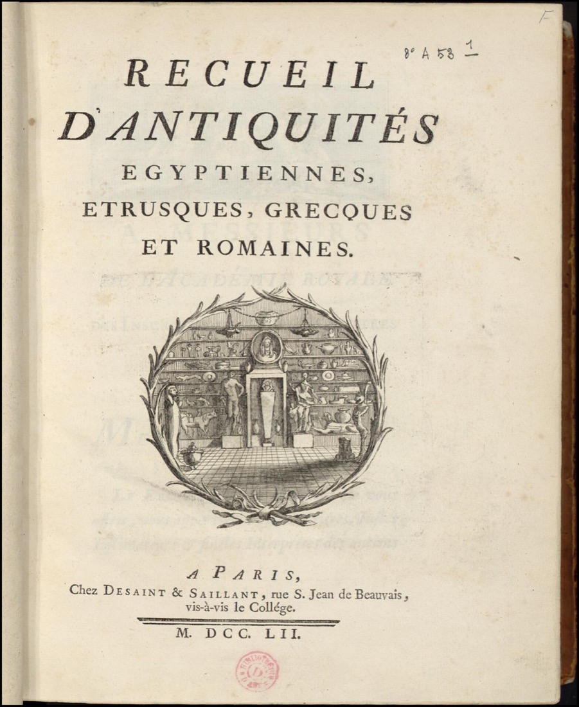

***

**Document n°3 - Anne Claude Philippe de Caylus (1692-1765)**

**_Recueil d'antiquités égyptiennes, étrusques, grecques et romaines_**

**Paris, chez Desaint et Saillant, 1752-1767**

**Bibliothèque de l'INHA, cote 4 RES 1847 (1-7)**

[consulter l'exemplaire numérisé ici](http://bibliotheque-numerique.inha.fr/idurl/1/5655){:target="_blank"}

7 volumes in-quarto (26 x 21 cm)

Reliure de veau fauve avec encadrements dorés, dos orné à cinq nerfs cloisonné de filets dorés, titre et tomaison.

Autre titre des vol. 3 à 7 : _Recueil d'antiquités égyptiennes, étrusques, grecques, romaines et gauloises_

***

Anne Claude Philippe de Pestels de Lévis de Tubières-Grimoard, comte de Caylus, né dans la plus haute noblesse
de France, est l’un des grands personnages de la République des Lettres, et ses écrits sur les œuvres antiques sont un jalon essentiel de l’histoire de l’archéologie.

Son intérêt s’éveille certainement lors d’un grand voyage méditerranéen commencé en 1714 qui l’emmène en Italie, où il passe deux ans, puis à Constantinople et en Turquie.
De retour à Paris, il fréquente le salon de Pierre Crozat (1661-1740), centre de la vie intellectuelle et artistique de Paris. Il se lie d’une profonde amitié avec Pierre-Jean Mariette avec lequel il collabore toute sa vie à de nombreux projets d’étude et d’édition, et tous deux entretiennent des relations avec tout un réseau savant en Europe et surtout en Italie.
Il constitue à partir des années 1720 une très importante collection d’objets antiques, qu’il achète à Paris ou fait venir d’Italie ;
elle sert de base à ses travaux, et il la publie, avec l’ajout de quelques autres pièces, dans son _Recueil_ à partir de 1752. Les œuvres y sont toutes décrites, commentées, et réunies
par civilisation : antiquités égyptiennes, étrusques, grecques, romaines, puis à partir du tome III, celtiques.

Cette collection n’est donc pour lui pas une fin en soi, mais un moyen d’accéder à la connaissance du passé en passant les objets, du plus artistique au moins prestigieux, au crible
de la raison méthodique, avec une grande attention aux usages et à la matérialité. Autre singularité : au fur et à mesure de ses publications, il dépose ses collections
au Cabinet du Roi pour qu’elles soient à disposition des amateurs.

Cette approche où collection matérielle et recueil d’illustrations sont conçus comme indissociablement
liés est tout à fait personnelle : les reproductions graphiques viennent en complément d’un examen direct des œuvres, dont l’accès est librement offert.
Les dessins ont été confiés à des artistes divers, dont l’identité n’est pas toujours connue, et le résultat est parfois assez éclectique.

S’il ne rédigea jamais de traité ou d’histoire faisant la synthèse de ses remarques et idées, ses écrits montrent que comme beaucoup de ses contemporains il était convaincu
de la supériorité de l’art grec. Comme Mariette, il affirme que l’œuvre est typique du _goût d’une nation_, et ouvre la voie à un classement typo-chronologique
qui deviendra la règle en archéologie. Le comparatisme qu’il prône dépasse d’ailleurs l’antiquité classique et touche l’Egypte ou les antiquités gauloises.

Cette absence de conceptualisation d’une idée générale de l’art le sépare de Winckelmann ; Caylus prône le recours à une méthode empirique, à la manière de la science physique naissante et hors de tout systématisme.

CC

Bibliographie : Aghion (dir.) 2002 ; Aghion, Zambon 2007 ; Aghion (dir.) 2009 ; Fumaroli 2016 ; Gentile Ortona, Modolo 2016

[Comte de Caylus. Recueils d'antiquités 1752-1767](http://caylus-recueil.huma-num.fr/){:target="_blank"}
