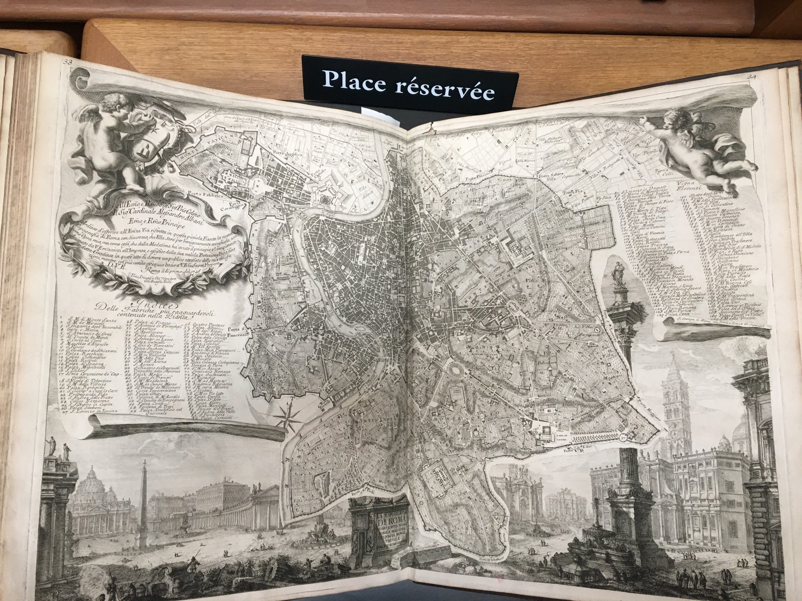

***

**Document n°5 - Giambattista Nolli (1701-1756)**

**_Nuova pianta di Roma_**

**Rome, 1748**

**Bibliothèque de l'INHA, [Fol C 208](http://bibliotheque.inha.fr/iguana/www.main.cls?surl=search#RecordId=1.228575)**

[Exemplaire numérisé d'une autre bibliothèque](http://arachne.uni-koeln.de/books/Nolli1748){:target="_blank"}

1 volume in-folio (50 x 40,5 cm)

Reliure en veau brun marbré avec encadrements dorés, dos orné à dix nerfs, pièce de titre.

Ex-libris collé au dos du plat de reliure : armes à la devise _Virtute itur ad astra_ d’E. G. Gillow

***

Le savoir cartographique était au milieu du XVIIIe siècle en pleine évolution, et la fameuse carte de Nolli parue en 1748 est une des manifestations les plus éclatantes du rationalisme des Lumières au service de la représentation de la ville. Giovanni Battista Nolli était un ingénieur originaire de Côme. Après avoir participé à la campagne de mise en carte de Milan par Charles VI d’Autriche (1685-1740) sous la supervision de Giovanni Giacomo Marinoni (1676-1755), mathématicien de la cour des Habsbourg, il arriva à Rome en 1736. Il travailla alors à une nouvelle cartographie de la ville, grâce au soutien de l’abbé Diego Revillas (1690-1746) de Milan, mathématicien et cartographe. Avec une équipe importante et armé des avancées techniques du temps (méthode de triangulation, table rotative, etc), il entreprit de reprendre entièrement les mesures de la ville, aussi bien dans les espaces publics que privés. Le résultat est une carte qui révolutionna la cartographie urbaine.

Dédiée au pape Benoît XIV, elle se présente en douze feuilles pouvant être assemblées en une grande carte par les acheteurs, pour une dimension totale de 176 x 208 cm (échelle 1/2900), accompagnée d’une version plus petite (_piccola pianta_). Une copie du plan de Leonardo Bufalini de 1551 fut également jointe : il s’agissait de la précédente carte orthogonale de la ville, ce qui permit à Nolli de rendre hommage à ce précurseur et aussi de montrer les progrès accomplis en trois siècles. La carte présentée est à la fois précise, exhaustive, et extrêmement pensée dans ses conventions graphiques : les espaces publics vides (rues, places, cours) sont laissés en blanc, tandis que les espaces privés (palais, couvents) sont hachurés en gris. L’accent est ainsi mis sur le réseau des rues et des places, formant l’image d’un tissu urbain interconnecté et organique. La carte est si précise que les égouts et fontaines sont indiquées, et elle intègre aussi les alentours immédiats de la ville, en dehors des murs. Les monuments antiques sont indiqués en noir, tandis que les bâtiments disparus sont figurés en pointillé quand ils sont bien documentés. Le nord est indiqué en haut de la feuille (ce qui n’était pas la norme auparavant) et un index de plus de 1300 sites numérotés permet de consulter aisément la carte. Ce plan issu du premier relevé scientifique de la ville fixa donc un nouveau standard, et il a servi de référence pour la géographie de Rome jusqu’au XXe siècle.

Tout un apparat figuratif entoure la carte proprement dite avec un important cadre en trompe l’oeil de feuilles qui s’enroulent ; les vignettes sont dessinées par Giovanni Paolo Panini (1691-1765) pour la _grande pianta_ ou Giovan Battista Piranesi (1720-1778) pour la _piccola pianta_, avec une exubérance qui contraste avec l’austérité du plan. On y trouve des amours en train de prendre les mesures ou de dérouler la carte elle-même, et des vues plus ou moins fantaisistes des monuments antiques et modernes de la ville (forum romain, colisée et arc de Constantin, musée du Capitole, église Saint-Pierre, etc).

CC

Biblio. : Bevilacqua 1998 ; Bevilacqua 2004; Lelo 2013 ; Verstegen (dir.) 2013 ; Maier 2016.
