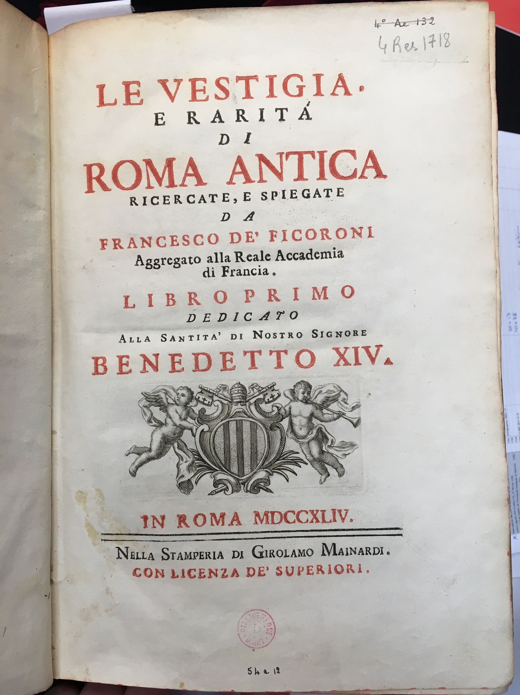

***

**Document n°6 - Francesco de’ Ficoroni (1664-1747)**

**_Le vestigia e raritá di Roma antica  ricercate, e  spiegate da Francesco de' Ficoroni aggregato alla Reale accademia di  Francia. Libro primo dedicato alla Santitá di  Nostro Signore Benedetto XIV_**

**Titre de la seconde partie : _Le singolarità di Roma moderna ricercate, e spiegate da Francesco de’ Ficoroni aggregato alla Reale Accademia di Francia._**

**Rome, Nella stamperia di Girolamo Mainardi, 1744**

**Bibliothèque de l’INHA, [cote 4 Res 1718](http://bibliotheque.inha.fr/iguana/www.main.cls?surl=search#RecordId=1.226413){:target="_blank"}**

[exemplaire numérisé d'une autre bibliothèque](http://arachne.uni-koeln.de/item/buchseite/354615)

   

      <input name="carousel" class="carousel-open" id="carousel-1" aria-hidden="true" type="radio" hidden="true" Checked/>
      

      

      <input name="carousel" class="carousel-open" id="carousel-2" aria-hidden="true" type="radio" hidden="true"/>
      

  
      

      <input name="carousel" class="carousel-open" id="carousel-3" aria-hidden="true" type="radio" hidden="true"/>
      

      

      <label class="carousel-control prev control-1" for="carousel-3">‹</label>
      <label class="carousel-control next control-1" for="carousel-2">›</label>
      <label class="carousel-control prev control-2" for="carousel-1">‹</label>
      <label class="carousel-control next control-2" for="carousel-3">›</label>

      <ol class="carousel-indicators">
         <li>
            <label class="carousel-bullet" for="carousel-1">●</label>
            

              
            

         </li>
         <li>
            <label class="carousel-bullet" for="carousel-2">●</label>
            

              
            

          </li>  
        
    </ol>

***

2 parties en 1 volume in-4° (28 x 20 cm)
Reliure en parchemin, dos avec titre et décor d’entrelacs à l’encre brune

***

L’un des plus célèbres - et des meilleurs - antiquaires romains de la première moitié du XVIIIe siècle, Francesco de’ Ficoroni (1664-1747) vécut surtout du marché. Il était très actif sur les terrains de fouilles et il accompagnait les visiteurs étrangers dans leurs visites aux monuments antiques. Le président de Brosses l’avait connu alors qu’il était désormais « vieux, sourd, parleur impitoyable et fatiguant » (Lettres familières, Giuseppina Cafasso et Letizia Norci Cagiano de Azevedo éd., Naples, Centre Jean Bérard, 1991, II, p. 900) et empêtré dans une polémique virulente puisqu’il avait osé critiquer le contenu du journal du voyage en Italie du père Montfaucon. Ficoroni avait amassé une immense documentation comprenant des dessins de monuments de la Rome antique, des centaines d’inscriptions, plus tard vendues au musée du Capitole, et des objets. À la fin de l'automne 1734, il participa à l’aménagement de la salle des Empereurs du nouveau musée du Capitole en tant qu’expert à côté du cardinal Alessandro Albani, de son secrétaire, le chanoine Antonio Baldani, et de Francesco Palazzi, alors « antiquaire de la chambre apostolique ».

Dans cet ouvrage de vieillesse, agrémenté d’illustrations qui représentent aussi bien des édifices que des œuvres d’art de toute sorte, Ficoroni fait le point sur toutes ses découvertes. Ainsi, au fil des pages, le lecteur s’instruit autant sur les monuments antiques de Rome et de ses alentours, debout ou encore ensevelis, que sur les dernières trouvailles des fouilles, sur les remplois ou sur des objets importants conservés chez des particuliers ou possédés par l’auteur lui-même. En accordant la plus grande importance aux matériaux, l’antiquaire ne néglige pas les sculptures ni les objets en terre cuite et, dans un long appendice, il décrit avec force détails les différents types de marbres que l’on pouvait voir alors à Rome. La seconde partie de l’ouvrage, très peu illustrée, est consacrée aux bâtiments du Vatican et du Transtévère, aux églises du Campo Marzio, aux principaux palais qui abritent des collections et des œuvres importantes, aux villas intra-muros et, hors-les-murs, à la Villa Borghèse et à la Villa Pamphili. À la fin du volume se trouve une estampe représentant l’Hercule Farnèse, gravée au burin par Giovanni De Franceschi d’après un dessin de Salvatore De Franceschi.

DG

Biblio. : Gallo 2005 ; Arata 2016, p. 79, 84, 93 et 127 ; Ridley 2017.

