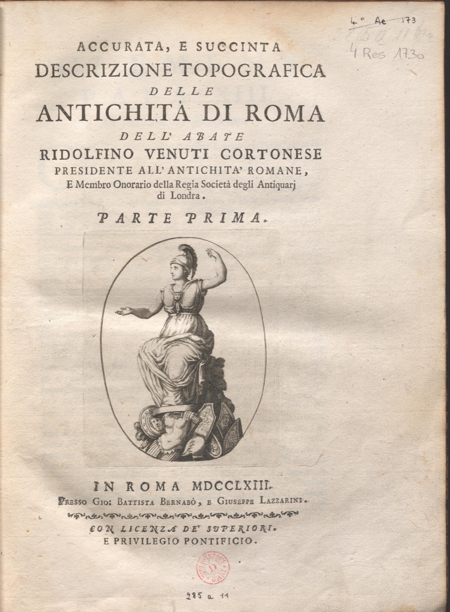

***

**Document n°9 - Ridolfino Venuti (1705-1763)**

**_Accurata e succinta descrizione topografica delle Antichità di Roma dell’abate Ridolfino Venuti Cortonese Presidente all’Antichità Romane, e Membro Onorario della Regia Società degli Antiquari di Londra_**

**Rome, Presso Gio. Battista Bernabò, e Giuseppe Lazzarini, 1763**

**Bibliothèque de l’INHA, [cote 4 Res 1730](http://bibliotheque.inha.fr/iguana/www.main.cls?surl=search#RecordId=1.227071){:target="_blank"}**

[exemplaire numérisé d'une autre bibliothèque](http://arachne.uni-koeln.de/books/Venuti1763Vol1)

   

      <input name="carousel" class="carousel-open" id="carousel-1" aria-hidden="true" type="radio" hidden="true" Checked/>
      

      

      <input name="carousel" class="carousel-open" id="carousel-2" aria-hidden="true" type="radio" hidden="true"/>
      

  
      

      <input name="carousel" class="carousel-open" id="carousel-3" aria-hidden="true" type="radio" hidden="true"/>
      

      

      <label class="carousel-control prev control-1" for="carousel-3">‹</label>
      <label class="carousel-control next control-1" for="carousel-2">›</label>
      <label class="carousel-control prev control-2" for="carousel-1">‹</label>
      <label class="carousel-control next control-2" for="carousel-3">›</label>

      <ol class="carousel-indicators">
         <li>
            <label class="carousel-bullet" for="carousel-1">●</label>
            

              
            

         </li>
         <li>
            <label class="carousel-bullet" for="carousel-2">●</label>
            

              
            

          </li>  
        
    </ol>

***

2 parties en 1 volume in-4°(29 x 22 cm)
Reliure en veau brun, dos orné à six nerfs avec motifs dorés, pièce de titre

***

Paru à titre posthume, cet ouvrage avait été conçu pour les visiteurs étrangers afin qu’ils pussent s’orienter facilement dans la topographie de la Rome antique. Il n’avait pas été pensé seulement comme un guide, mais comme un outil pour interpréter les sources. Ainsi, après une introduction faisant le point sur la morphologie et l’aspect urbain de la cité antique, la description topographique démarre au Palatin, « en tant qu’origine de la première Rome de Romulus », conduit le « touriste » à travers le Forum Romain et le Capitole, les forums de César, d’Auguste, de Nerva et de Trajan, et le fait monter ensuite sur les collines du Quirinal, du Viminal, de l’Esquilin et du Célius. Dans la seconde partie, on parcourt la Voie Appienne, on monte à l’Aventin et on traverse ensuite le _Campo Marzio_ pour atteindre l’île Tibérine et le Transtévère. Venuti y décrit les monuments encore debout ou en ruine (les plus célèbres sont illustrés) et n’oublie pas d’évoquer les édifices disparus. À la fin du volume, une « carte topographique »  permet d’avoir une vue d’ensemble de « tous les vestiges des anciennes fabriques selon le tour méthodique que faisait autrefois l’abbé Ridolfino Venuti et qui est enseigné par lui-même dans son ouvrage ». Un index des « choses les plus importantes » (p. 113-135 de la seconde partie), facilite encore la consultation de l’ouvrage.

La qualité moyenne des images gravées, qui sont très souvent des reproductions de gravures d’artistes célèbres tels que Piranèse, J. Ch. Bellicard ou Jean Barbault, déjà imprimées dans des guides ou des recueils des années 1740, n’empêcha pas la réussite éditoriale de cet ouvrage, qui fut réédité, avec des mises à jour, en 1803 et en 1824.

La publication de cette première édition fut assurée par une souscription à laquelle adhérèrent des personnages aussi célèbres que les cardinaux Alessandro Albani et Neri Corsini, le duc de Devonshire, Piranèse ou l’architecte londonien James Adam. Winckelmann lui-même, qui succéda à Ridolfino Venuti comme préfet aux antiquités de la ville de Rome, souscrivit à côté des soixante-onze Italiens et des cent-quatre-vingt-douze Anglais qui permirent la parution de l’ouvrage après la mort de son auteur.

Né à Cortone en 1705, Ridolfino Venuti mourut à Rome le 30 mars 1763. Il avait été l’un des fondateurs de l’Académie étrusque de Cortone ([voir notice n°10](./document10.md)). Avant d’être nommé commissaire aux antiquités de Rome et conservateur des galeries pontificales par le pape Benoît XIV en 1744, il avait été auditeur du cardinal Alessandro Albani, dont il avait publié la collection de médailles antiques. Il devint célèbre parmi les voyageurs illustres du Grand Tour, qu’il accompagnait lors de leurs visites aux monuments en arrondissant ainsi ses fins de mois. La liste de ses publications est imprimée à la fin de ce volume (p. 143 de la seconde partie), où est reproduite aussi la longue inscription latine que le Cortonais Niccolò Lucci, chanoine de l’église Saint-Eustache à Rome, avait préparée pour le tombeau  qu’il était en train de faire élever à Ridolfino Venuti dans l’église San Nicola in Arcione.

DG

Biblio. : Winckelmann 1961, p. 224 (lettre du 30 avril 1763) ; Gallo 1985 ; Gallo 2005 ; Bentz 2012.

