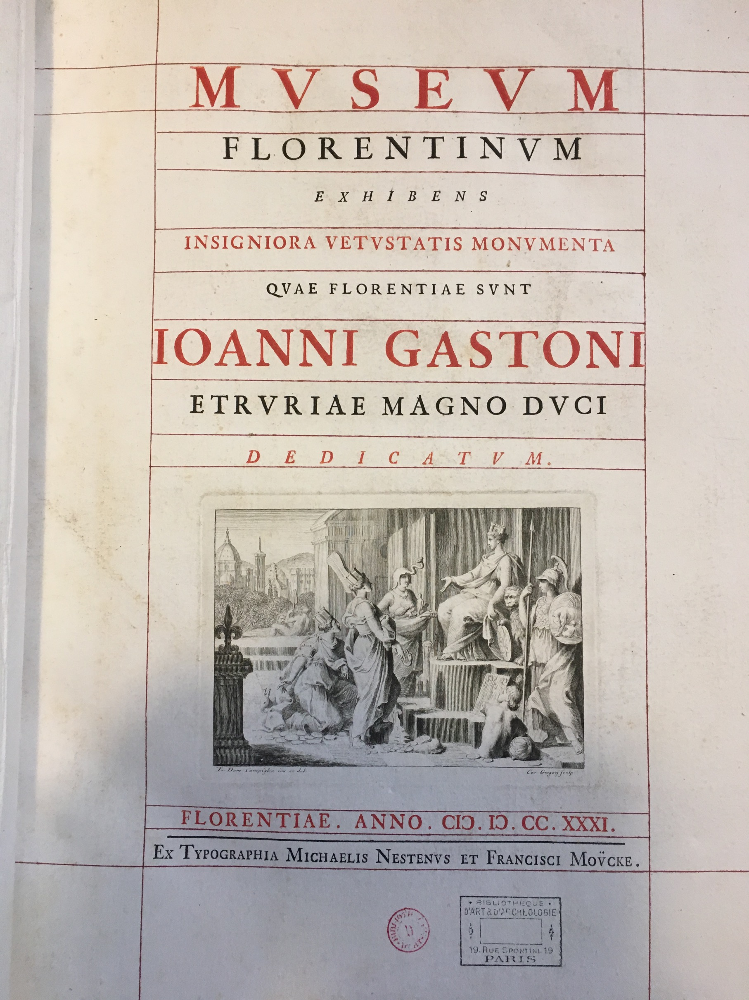

## Winckelmann à la bibliothèque de l'INHA

Cette exposition virtuelle met en valeur les fonds de la bibliothèque de l'INHA relatif à l'historien de l'art Johann Joachim Winckelmann.
Elle a été réalisée à l'occasion d'une présentation en salle Labrouste du 22 au 30 novembre 2018.

---

  

    
    
    
    
    

  

  

    
    
    
    
    

  

  

  
  
  
  
  

  

  

  
  
  
  
  

  

---

## Avant-propos

Contrairement à ce que l’on pourrait s’imaginer, la bibliothèque de l’INHA ne possède pas les premières éditions allemandes des écrits de Winckelmann.

Ainsi, de ses éditions originales, le lecteur n’y trouvera que la Description des pierres gravées du feu Baron de Stosch, parue à Florence, chez Bonducci, en 1760, et les Monumenti Antichi Inediti, publiés à Rome à compte d’auteur en 1767.
 La première est une acquisition du début du XXe siècle - elle se trouvait déjà rue Spontini, dans la bibliothèque que René-Jean avait organisée pour Jacques Doucet -, tandis que le second ouvrage avait appartenu à l’architecte écossais Charles Cameron, nommé architecte de la tzarine Catherine la Grande en 1779.

 Toutes les autres éditions anciennes des écrits de l’antiquaire sont des traductions françaises, arrivées à la bibliothèque à des moments différents par achat ou par don. Parmi les donateurs qui avaient possédé une édition française de la Geschichte der Kunst des Alterthums on retiendra les noms de Louis Dimier et du chanoine Jacques-Camille Broussolle. Dans l’ancien fonds Jacques Doucet se trouvaient encore un exemplaire des Lettres familières de M. Winckelmann publié à Amsterdam en 1781 et le discours sur Winckelmann prononcé par le professeur Carl Morgenstern à l’université de Dorpat le 12 décembre 1803. La bibliothèque de l’INHA possède en outre l’édition originale de la seconde édition du Winckelmann und seine Zeitgenossen de Carl Justi et la biographie que Ferdinand Bac a fait paraître à Paris en 1929. Elle conserve aussi une lettre manuscrite, datée de Rome le 14 février 1761 et rédigée en italien.

> Nous n’avons pas souhaité présenter les éditions modernes des ouvrages de Winckelmann conservées dans la bibliothèque de l’INHA ni les nombreux travaux qui lui ont été consacrés dans la seconde moitié du XXe siècle répertoriés dans son catalogue. En revanche, pour mieux encadrer l’exposition de ces écrits winckelmanniens des XVIIIe et XIXe siècles, nous avons choisi d’exposer d’autres ouvrages illustrés du XVIIIe siècle. Il s’agit d’écrits d’antiquaires florentins, romains et parisiens contemporains de Winckelmann ou de la génération précédente, et de recueils dont les images évoquent les promenades de l’antiquaire parmi les monuments antiques et les édifices modernes de la Ville éternelle.

Nous avons pu réaliser ce travail grâce à l’accord et au soutien de France Nerlich, directrice du département des études et de la recherche, d’Anne-Elisabeth Buxtorf, directrice de la Bibliothèque de l’INHA. Il a été réalisé en étroite collaboration avec Christine Ferret, chef de service du développement des collections, et Juliette Robain, conservatrice au service du patrimoine. Le service des manifestations et la direction de la communication ont été essentiels dans la mise en place du projet. La version numérique de l’exposition a été conçue et réalisée par Antoine Courtin, responsable de la cellule d'ingénierie documentaire, avec l’aide de Maï Delhomme, du service des manifestations, et Bastien Rueff, chargé d’études et de recherche au département des études et de la recherche. L’aide de ce dernier nous a été particulièrement précieuse lors de toutes les étapes de la mise en place de l’exposition et de la mise au point de l’édition numérique de ce catalogue. À toutes et à tous, nous exprimons notre gratitude la plus sincère.

Cécile Colonna et Daniela Gallo, Paris le 10 novembre 2018.

[Pour en savoir + sur le colloque](https://www.inha.fr/fr/agenda/parcourir-par-annee/en-2018/novembre-2018/winckelmann-et-l-uvre-d-art-materiaux-et-types.html)

