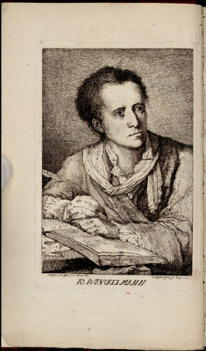

## Winckelmann et l’œuvre d’art : Matériaux et types

En accompagnement du colloque, la bibliothèque de l’INHA présentera en salle Labrouste une exposition dossier autour de ce « père fondateur » de l’histoire de l’art et de l’archéologie. Des livres du XVIIIe siècle, certains somptueusement illustrés, seront sortis des collections de la bibliothèque et exposés aux yeux de tous.

[Pour en savoir + sur le colloque](https://www.inha.fr/fr/agenda/parcourir-par-annee/en-2018/novembre-2018/winckelmann-et-l-uvre-d-art-materiaux-et-types.html)

| | | |
|:-------------------------:|:-------------------------:|:-------------------------:|
|  [objet n°1](./document1.md) |  ||
|  |  ||
|  |  ||

### Markdown

Markdown is a lightweight and easy-to-use syntax for styling your writing. It includes conventions for

```markdown
Syntax highlighted code block

# Header 1
## Header 2
### Header 3

- Bulleted
- List

1. Numbered
2. List

**Bold** and _Italic_ and `Code` text

[Link](url) and 
```

For more details see [GitHub Flavored Markdown](https://guides.github.com/features/mastering-markdown/).

### Jekyll Themes

Your Pages site will use the layout and styles from the Jekyll theme you have selected in your [repository settings](https://github.com/antoinecourtin/text_expoVirtuelle/settings). The name of this theme is saved in the Jekyll `_config.yml` configuration file.

### Support or Contact

Having trouble with Pages? Check out our [documentation](https://help.github.com/categories/github-pages-basics/) or [contact support](https://github.com/contact) and we’ll help you sort it out.
