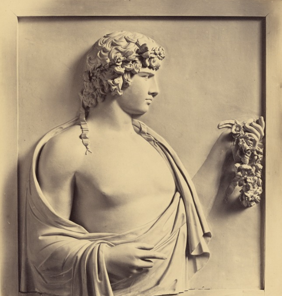

## Introduction : Winckelmann et l’histoire de l’art antique

Si les œuvres de l’antiquité ont été rassemblées et étudiées depuis la Renaissance, au XVIIIe siècle la façon de les considérer change radicalement. Dans un contexte de construction de nouveaux savoirs rationnels sur l’homme et la nature, les découvertes archéologiques de plus en plus nombreuses encouragent le développement d’une véritable science pour les étudier.

>Progressivement, les œuvres qui nous parviennent des civilisations antiques ne sont plus considérées comme de simples illustrations des textes grecs et latins, mais sont étudiées en elles-mêmes et dans tous leurs aspects : de leur analyse rigoureuse découle le savoir.  

<small style="text-align:center">fig.1 : Anton von Maron (1733-1808), Portrait de Johann Joachim Winckelmann, 1768, huile sur toile, château de Weimar.</small>

**Johann Joachim Winckelmann** compte parmi ceux qui ont mis en œuvre ce changement épistémologique majeur, et il est sans doute celui dont l’influence a été la plus importante, de son vivant comme après sa mort prématurée[1](#myfootnote1). Mais la “fascination de l’antique” qui caractérise l’époque va bien au-delà des cercles érudits : toute l'Europe lettrée redécouvre alors ce passé lointain dont on débat à Paris ou à Londres, dans les salons et en société, entre artistes, collectionneurs et ces spécialistes que l’on appelle encore des “antiquaires”.								 

### Winckelmann, de l’Allemagne à l’Italie

Rien se semblait prédisposer Johann Joachim Winckelmann à la carrière ni à la vie qu’il a mené. Il nait le 9 décembre 1717 dans un petite ville sur l’Elbe, Stendal, dans un milieu modeste (son père est cordonnier). Après des études de théologie à l’université de Halle puis de médecine à Jena, il gagne chichement sa vie en devenant en 1743 précepteur dans une école de la petite ville de Seehausen.

Déjà féru de textes antiques et excellent helléniste, il réussit à être engagé en 1748 comme bibliothécaire par Heinrich von Bünau, dans le château de Nöthnitz (en Saxe), qui conserve pas moins de 42 000 volumes. Des visites à Dresde lui font déjà entrevoir les trésors artistiques exposés dans la capitale : sous l’impulsion de l’électeur de Saxe et roi de Pologne Frédéric-Auguste (1670-1733), la ville était devenue un véritable centre culturel et artistique. Winckelmann y déménage en 1754, hébergé par son ami le peintre et sculpteur Adam Friedrich Oeser (1717-1799) ; il y fréquente les artistes, amateurs et collectionneurs et étudie les riches collections royales.

>Le faste du baroque qui règne alors à Dresde n’est pas de son goût : ce que Winckelmann admire, ce sont les sculptures de marbre antiques et leur retenue.

Cette découverte lui inspire son premier ouvrage, Réflexions sur l’imitation des œuvres grecques dans la peinture et la sculpture : il veut montrer en quoi l’art antique, et surtout l’art grec, est parvenu à une certaine perfection dans le rendu de la beauté (d’où la fameuse formule : “une noble simplicité et une grandeur tranquille, tant dans l’attitude que dans l’expression, voilà en définitive le trait général qui distingue par excellence les chefs-d’œuvre grecs”). Il veut ainsi inciter les artistes à puiser dans ces modèles pour revivifier leur art et exceller à leur tour.

Pourtant, Winckelmann n’a encore eu que peu de contact direct avec les marbres antiques. Si les collections de Dresde sont les plus importantes d’Europe du Nord, elles sont difficilement visibles, et c’est surtout à partir de ses lectures que le savant élabore ses réflexions. Pour continuer l’étude de l’art, une destination s’impose alors : Rome, capitale des arts, le centre des collections antiques comme du savoir.

<small style="text-align:center"> fig.2 : Carte de l’Europe, 1759  </small>

Après une conversion opportuniste au catholicisme, par le cardinal Alberico Archinto (1698-1758), nonce apostolique à Dresde, il obtient une pension d'Auguste III pour poursuivre ses études à Rome, où il arrive en novembre 1755.  Il découvre alors les collections de la ville, à commencer par celles du Vatican et du musée du Capitole qu’il fréquente avec passion.

<small style="text-align:center"> fig.3 : Hubert Robert (1733 - 1808), Un dessinateur dans la galerie du Capitole, vers 1765, sanguine, The J. Paul Getty Museum, Los Angeles.
 </small>

Il s’enflamme notamment pour les célèbres sculptures de la cour du Belvédère : l’Apollon, le Torse ou le Laocoon (fig.4).

<small style="text-align:center"> fig.4 :“Apollon du Belvédère”, copie romaine d’un original de Léocharès du IVe siècle av. J.-C., marbre, Vatican, Museo Pio-Clementino </small>

Son séjour devient permanent grâce aux appuis qu’il obtient : d’abord brièvement bibliothécaire des cardinaux Archinto et Passionei, à partir de 1758 il devient celui du cardinal Alessandro Albani (1692-1779) avec lequel il se lie d’une solide amitié et qui soutient ses activités savantes. Il y est en charge de toutes les collections rassemblées par le riche amateur : les livres, les dessins et estampes, les peintures, et bien sûr les antiquités, exposées dans le palais de la rue des Quatre-Fontaines et dans la villa aménagée au delà de la Porta Salaria.

<small style="text-align:center"> fig.5 : Giovanni Battista Piranesi (1720-1778), Vedute di Roma, Rome, 1748, pl.XXXVI : Villa Albani, bibliothèque de l’INHA. </small>

Il visite toutes les collections et regarde toutes les œuvres : à Rome même, les nouvelles fouilles comme les autres grandes collections particulières (Farnèse, Giustiniani, Ludovisi, Barberini, Borghèse, Mattei, Negroni...), mais aussi ailleurs en Italie. Il voyage plusieurs fois à Naples dès 1758, pour voir les fouilles des cités campaniennes (Pompéi, Herculanum, Stabies etc.) et le musée royal de Portici ; il en publie des rapports en 1762 et en 1764. Il connaît Florence aussi, où il se rend en 1758 pour publier la collection de pierres gravées du baron Philipp von Stosch (1691-1757), récemment décédé. A cette époque, on trouve dans tous ces fonds bien sûr des antiquités sorties du sol italien (grecques, étrusques ou romaines), mais aussi des objets venus de Méditerranée orientale, notamment des œuvres égyptiennes, et de nombreuses pierres gravées et monnaies qui circulent facilement.

Grâce à sa connaissance intime et encyclopédique des œuvres, il affine sa pensée et publie plusieurs essais. Ami intime du peintre Anton Raphaël Mengs (1728-1779), il fréquente les cercles savants et artistiques de Rome, et entretient une correspondance soutenues dans toute l’Europe des lettres. Il accompagne aussi volontiers les visiteurs de marque pour leur faire découvrir les collections romaines, se faisant leur Cicerone. Il devient ainsi en quelques années un spécialiste reconnu ; en 1763 il est nommé Antiquaire apostolique, et l’année suivante bibliothécaire et scripteur de la bibliothèque vaticane. Il publie alors son œuvre majeure, l’Histoire de l’art chez les Anciens, suivi de quelques autres ouvrages, dont les Monuments inédits en 1767.

Mais une mort tragique met un terme brutal et prématuré à cette brillante carrière : revenant d’un voyage en Allemagne et à Vienne, il est assassiné le 8 juin 1768 dans une auberge de Trieste, par un malfrat qui lui dérobe les médailles antiques offertes par Marie-Thérèse et Joseph II d'Autriche.

### L’Histoire de l’art de l’antiquité, une œuvre fondatrice

Synthèse de ses connaissances sur l’art antique et de ses idées sur l’Art en général, cette œuvre majeure est la contribution la plus décisive de Winckelmann à l’histoire du savoir.

<small style="text-align:center"> fig.6 :  J.J. Winckelmann, Geschichte der Kunst des Altertums, 1764, page de titre.</small>

Si l’ouvrage est dense et riche de références aux œuvres comme aux textes, il cherche clairement à dépasser la simple érudition pour proposer à la fois un récit historique et une interprétation des œuvres et des styles. On retrouve les idées principales déjà exposées dans les Réflexions parues neuf ans plus tôt, mais elles sont développées et complétées pour proposer un véritable système.

La première phrase explose clairement le but fixé :
>“L’histoire de l’art chez les Anciens que j’ai entrepris d’écrire n’est pas une simple relation chronologique des changements qui la constituent, car je prends le mot “histoire” dans sa signification étendue, celle qu’il a dans la langue grecque, et mon intention est de donner un essai de système doctrinal.”

L’histoire grecque, c’est celle ouverte par Hérodote et pensée comme une enquête pour comprendre le passé : effectivement, Winckelmann cherche à comprendre l’art antique, et au-delà les conditions historiques et culturelles de sa production. Pour cela, il met au point une méthode d’examen critique des vestiges mis au jour, avec l’appui constant des textes antiques. Pour lui, l’art de chaque peuple passe par différentes phases calquées sur le modèle biologique : naissance, maturité, déclin. Comme un homme, chaque civilisation et donc chaque art naît, se développe, atteint sa maturité avant de décliner et mourir.

Tous les arts de l’antiquité sont examinés successivement : celui des Égyptiens, des Phéniciens, des Perses, des Étrusques, des Grecs puis des Romains. La distinction entre art grec et art romain est ainsi pour la première fois clairement posée. Parmi eux, celui qui, de loin, retient le plus l’attention de l’auteur, c’est l’art grec, qui lors de sa maturité a atteint le plus haut degré de perfection. Ce succès s’explique selon Winckelmann par différents facteurs ; le climat méditerranéen, d’abord, était propice à la beauté des corps, qui étaient de plus entretenus par les exercices athlétiques. Le mode de vie des cités hellènes permettait par ailleurs aux artistes de voir ces beaux corps nus, en exercice et dans toutes les attitudes, de les étudier et de les copier. Mais le facteur essentiel qui leur a permis de comprendre cette beauté naturelle, et de la transcender, c’est la liberté politique et sociale dont ils jouissaient. On le voit, le style est au coeur des préoccupations winckelmanniennes, et la beauté, c’est d’abord celle des corps

<small style="text-align:center"> fig.7 : “Torse du Belvédère”, Ier siècle av. J.-C., marbre, Vatican, Museo Pio-Clementino. </small>

Pourquoi cette Histoire de l’Art a-t-elle révolutionné l’approche des œuvres ? La nouveauté est triple : par la volonté de faire un récit historique, Winckelmann se démarque des écrits érudits des antiquaires, qui traditionnellement juxtaposent les explications de chaque objet. Et cette histoire est une histoire de l’art, et non pas une histoire des artistes : il cherche ainsi à rompre avec la tradition des vies d’artistes, qui remonte à Giorgio Vasari (1511-1574) et au-delà aux écrivains antiques. Il insère ainsi sa démarche et son œuvre dans une histoire universelle dont les multiples chapitres sont en train de s’écrire au siècle des Lumières. Enfin, par son modèle d’évolution artistique, il pose l’art comme idée, au sens philosophique du terme, un Art qui s’incarne dans des œuvres portées par une histoire analogue à celle de la vie des hommes. L’important est alors l’étude et la compréhension du style, et pas seulement la compréhension du sujet représenté. C’est un nouveau regard que Winckelmann propose à ses contemporains, dans un style passionné, convaincu de la beauté des œuvres antiques et résolu à convaincre de la nécessité pour les artistes de revenir à cette source.

### Winckelmann, un homme du XVIIIe siècle

Pour lui, le lien avec la création de son temps est essentiel, et d’ailleurs il fréquente de près peintres et sculpteurs. Dans la plupart de ses écrits, il s’adresse clairement aux artistes, et propose aussi des considérations techniques sur la manière de créer des anciens ; en cela il s’insère dans une tradition des écrits et discours sur l’art qui, depuis la Renaissance, se doivent d’apporter des modèles ou des normes pour la création. L’art antique est donc clairement proposé comme modèle, mais en même temps, par son insertion dans le récit historique, il appartient à un passé révolu et donc impossible à répéter : il doit servir d’inspiration. Pour autant, Winckelmann n’est pas à l’origine du mouvement néo-classique, dont les tendances étaient déjà bien présentes dans la culture européenne. Mais il en a rédigé le plus éclatant manifeste, et il a ainsi puissamment contribué à son développement.

On a eu tendance à exagérer la nouveauté radicale de l’approche de Winckelmann ;  en fait, le savant allemand, lecteur assidu des auteurs anciens comme modernes, s’inscrit pleinement dans l’évolution des connaissances et des méthodes de son temps. Ses positions ne sont pas toujours aussi nouvelles qu’il ne l’affirme lui-même, ou que la postérité lui a reconnu. Il connaît bien la tradition romaine et florentine d’étude de l’antique, lit et rejoint sur de nombreux points les Français de la génération précédente, Mariette et Caylus, ou les archéologues d’Europe du Nord. Mais il intègre aussi la tradition des écrits allemands plus théoriques, notamment dans les redéfinitions de l’art et de l’esthétique. Et c’est là peut-être son apport décisif : opérer une synthèse historique et philosophique à partir de traditions séparées. Cela explique le succès de ses écrits de son vivant, et le fait que son nom évoque à lui seul les évolutions majeures dans la pensée du XVIIIe siècle.

La nouveauté réside aussi dans la langue et le ton des écrits. Winckelmann considère les œuvres antiques comme si elles étaient contemporaines, et n’hésite pas à émettre des jugements très net sur l’art antique comme moderne : les deux sont souvent mêlés et comparés. Parmi les peintres européens, c’est Raphaël qu’il place sur la plus haute marche, louant la pureté de son trait, tandis qu’il est très dur avec des artistes comme le Bernin, qui incarne à ses yeux tous les excès du baroque. Mais son approche est aussi éminemment sensible et il a su montrer à ses lecteurs des beautés parfois difficiles à appréhender. Ses écrits offrent ainsi une vision érotique de la sculpture antique, les œuvres sont décrites avec une passion qui a inspiré beaucoup de lecteurs.

<small style="text-align:center"> fig.8 : Robert Macpherson (1811 - 1872), Antinous - bas relief, Villa Albani, vers 1860, Tirage sur papier albuminé, The J. Paul Getty Museum, Los Angeles. </small>

### Winckelmann hier et aujourd’hui

La postérité de Winckelmann est immense, et ses idées ont irrigué aussi bien l’histoire, l’archéologie, la philosophie et l’histoire de l’art, comme en témoignent les nombreuses éditions et traductions de ses écrits, de son vivant ou après sa mort. C’est en Allemagne sans doute que sa figure a eu le plus profond retentissement, avant tout sur le classicisme du cercle de Weimar porté par Johann Wolfgang von Goethe (1749-1832) et Johann Gottfried Herder (1744-1803)  : dès le début du XIXe siècle, il devient le symbole de la culture allemande.
Différentes dimensions de son oeuvre ont été retenues au fil du temps, selon les milieux ou les disciplines, et les héritages sont multiples. Ainsi, la France révolutionnaire va faire avant tout une lecture politique de Winckelmann, et mettre en avant le lien primordial établi entre l’art et la liberté ; Paris sera la capitale des arts, une nouvelle Athènes, patrie de la liberté, et c’est au nom de ces principes qu’on justifiera lors des campagnes napoléoniennes le déplacement des chefs-d’œuvres de l’Europe entière dans la capitale française.  

Certains aspects du personnage aussi ont façonné sa légende : sa mort brutale et inattendue, pour un motif mal défini, donne un tournant tragique à son existence. Son homosexualité, qui est clairement révélée dans sa correspondance, est semble-t-il bien connue de ses amis, mais elle ne pouvait pas être ouvertement déclarée à son époque (autre liberté de moeurs dont jouissaient les Grecs de l’antiquité, au contraire des Européens de son temps).

Winckelmann est pleinement un homme du XVIIIe siècle : sa pensée est à de nombreux points de vue datée et dépassée, et elle a été à juste titre critiquée, notamment pour son emploi de la notion de race et l’importance qu’il lui donne dans la définition des styles. Il a refusé de considérer, au contraire de Caylus, des influences extérieures (notamment égyptiennes) sur l’art grec, créant ainsi une pureté grecque originelle largement fantasmée, qui fait écho à son exaltation de la blancheur du marbre, alors que l’on sait maintenant que les sculptures antiques étaient majoritairement polychromes. Il faut dire aussi que Winckelmann n’a jamais été en Grèce même ; ses lettres dévoilent le projet d’un voyage toujours repoussé. Sa vision de la cité grecque est donc pour une large part une construction moderne, et on a depuis longtemps raillé le fait qu’il ait théorisé la perfection grecque classique à partir d’œuvres que l’on sait maintenant être datées de l’époque romaine.

<small style="text-align:center"> fig.9 : Agésandros, Athanadoros et Polydore, Laocoon et ses fils, Ier siècle av. J.-C., trouvé à Rome dans les thermes de Trajan en 1507, marbre, Vatican, Museo Pio-Clementino.</small>

Par bien des aspects, il a voulu faire correspondre son jugement sur les œuvres à l’idée préconçu qu’il avait de la beauté antique. On a donc aujourd’hui une lecture plus distanciée et critique de ces textes, qui restent essentiels pour comprendre l’histoire de la discipline.

Mais des approches parlent plus directement à l’historien de l’art d’aujourd’hui. Si l’on revient aux textes, on se rend compte que Winckelmann a écrit sur tout ce qui concerne l’antiquité. Son goût pour la grande sculpture ne l’a pas empêché d’étudier les pierres gravées, les peintures murales, les vases grecs, les monnaies, et même les instruments de la vie quotidienne ou inscriptions sortis du sol romain .

<small style="text-align:center"> fig.10 : P.-F.H. d’Hancarville, Collection of Etruscan, Greek and Roman Antiquities from the Cabinet of the Hon. W. Hamilton, Naples, 1766, vol.1, pl.127. </small>

<small style="text-align:center"> fig.11 : Intaille de la collection Stosch, dans  Johann Joachim Winckelmann, Monumenti antichi inediti, Rome, 1767, pl.97.</small>

Si son influence se sent dans l’importance accordée au style dans l’archéologie classique et dans ses liens forts avec l’histoire de l’art (par rapport aux autres champs de l’archéologie), elle est aussi à l’œuvre dans le développement d’une herméneutique perceptible dans les Monumenti inediti ou les écrits sur les sites campaniens.

Il le répète à de nombreuses reprises :
> il faut regarder les œuvres, toutes les œuvres, et y revenir sans cesse ; la beauté comme la connaissance se méritent.

Mais cet examen poussé ne doit pas déboucher sur une érudition stérile, et Winckelmann n’a que dédain pour les érudits pour lesquels une œuvre n’est que le prétexte de commentaires sans fin. Lier l’archéologie la plus exigeante à une appréciation esthétique la plus sensible, ouvrir la discipline au-delà du cercle des spécialistes : voilà sans doute des considérations qui résonnent encore aujourd’hui.

Cécile Colonna, conseillère scientifique en charge du domaine "Histoire de l'art antique et de l'archéologie" à l'INHA

#### Table des illusration
1. Anton von Maron (1733-1808), Portrait de Johann Joachim Winckelmann, 1768, huile sur toile, château de Weimar.  https://commons.wikimedia.org/wiki/File:Johann_Joachim_Winckelmann_(Anton_von_Maron_1768).jpg)
2. Carte de l’Europe, 1759.  https://fr.wikipedia.org/wiki/Fichier:Carte_europe_1763.jpg
3. Hubert Robert (1733 - 1808), Un dessinateur dans la galerie du Capitole, vers 1765, sanguine, The J. Paul Getty Museum, Los Angeles.
4. “Apollon du Belvédère”, copie romaine d’un original de Léocharès du 4e siècle av JC, marbre, Vatican, Museo Pio-Clementino. https://fr.wikipedia.org/wiki/Fichier:Belvedere_Apollo_Pio-Clementino_Inv1015_n4.jpg © Marie-Lan Nguyen / Wikimedia Commons.
ou photo ancienne du Getty : (vers 1870–1890, Tirage sur papier albuminé, The J. Paul Getty Museum, Los Angeles).
5. Giovanni Battista Piranesi (1720-1778), Vedute di Roma, Rome, 1748, pl.XXXVI : Villa Albani, bibliothèque de l’INHA.
6. J.J. Winckelmann, Geschichte der Kunst des Altertums, 1764, page de titre.
7. “Torse du Belvédère”, Ier siècle av. J.-C., marbre, Vatican, Museo Pio-Clementino.
(http://www.museivaticani.va/content/museivaticani/fr/collezioni/musei/museo-pio-clementino/sala-delle-muse/torso-del-belvedere.html ; image du dos wikipédia - jmax@flickr : https://commons.wikimedia.org/wiki/File:Belvedere_Torso.jpg)
8. Robert Macpherson (1811 - 1872), Antinous - bas relief, Villa Albani, vers 1860, Tirage sur papier albuminé, The J. Paul Getty Museum, Los Angeles.
9. Agésandros, Athanadoros et Polydore, Laocoon et ses fils, Ier siècle av. J.-C., trouvé à Rome dans les thermes de Trajan en 1507, marbre, Vatican, Museo Pio-Clementino.
(image libre de droits sur wikipedia : https://commons.wikimedia.org/wiki/File:Laocoon_Pio-Clementino_Inv1059-1064-1067.jpg, © Marie-Lan Nguyen / Wikimedia Commons)
10. Hydrie attique à figures rouges, signée par Meidias, 420-400 av. J.-C., terre cuite, Londres, British Museum.
(photo musée) + planche coll. Hamilton 1766 I pl.127
11. Intaille de la collection Stosch, dans  Johann Joachim Winckelmann, Monumenti antichi inediti, Rome, 1767, pl.97.

* * *

<small>
<a name="myfootnote1">1</a>: Haskell, Penny 1988 ; Polignac, Raspi Serra 1998.
</small>

